# MCN Information System Platform  
# M1 阶段架构方案：Content Workspace Module / 内容工作台模块

> **版本 v2（已合并原型阶段确认的全部变更）**　前端主体风格/字体/组件标准见独立文档《MCN 内容工作台 · 前端设计文档》。可执行建表脚本见 `mcn_m1_schema.sql`。

## 一、项目定位

`MCN Information System Platform` 是面向 MCN 内容运营场景建设的信息系统平台。

平台长期可以分为三大业务板块：

```text
MCN Information System Platform
├── M1：内容工作台 Content Workspace
│   └── 承接旧 Ai_Toolbox 的十几个内容工具
│
├── M2：红人管理与运营增强
│   └── 红人入驻问卷（AI 对话式）、运营端首页重设计、后续更多运营功能
│
└── M3：短视频 / 直播（规划中）
    └── 短视频采集/解析/字幕/评论/分析，直播录制/弹幕/话术/复盘等
```

**M1 阶段只建设内容工作台模块**，暂不展开短视频和直播模块。

**M2 阶段正在进行中**，聚焦红人管理与运营端体验增强。

---

## 二、M1 阶段目标

M1 阶段目标不是一次性做完整 MCN 平台，而是先完成：

```text
新平台基础架构
+
内容工作台入口
+
第一个旧工具模块迁移
```

M1 具体目标：

```text
1. 搭建 React / Vite / Ant Design 前端
2. 搭建 Python FastAPI 后端
3. 实现管理员端 / 运营端分离
4. 实现管理员开通账号
5. 实现用户登录与 JWT 鉴权
6. 实现首次登录强制改密
7. 第一阶段数据库使用本地 / 测试服务器 PostgreSQL
8. 实现内容工作台入口
9. 实现内容工具列表与工具状态管理
10. 实现统一任务记录 task_jobs
11. 实现统一产出记录 outputs
12. 实现导出文件记录 files
13. 封装 AI / TikHub / OSS 外部服务适配层
14. 迁移第一个旧工具：人设脚本仿写
```

人设脚本仿写旧模块对应 `persona-writer-web`，流程为：**选择达人 → 对标验证 → 仿写创作 → 导出 Word**。

---

## 三、M1 阶段不包含范围

M1 阶段暂不建设：

```text
1. 短视频完整模块
2. 直播完整模块
3. 内容规划模块
4. 完整红人数据中台
5. 完整产品数据中台
6. 高级项目看板
7. 大规模任务调度
8. Redis
9. CDN
10. WAF
11. SLS 日志服务
12. GitHub Actions 自动部署
13. 正式 RDS
14. Kubernetes
15. 微服务架构
```

这些能力只在架构上预留，不作为 M1 交付范围。

---

## 四、M1 整体架构图

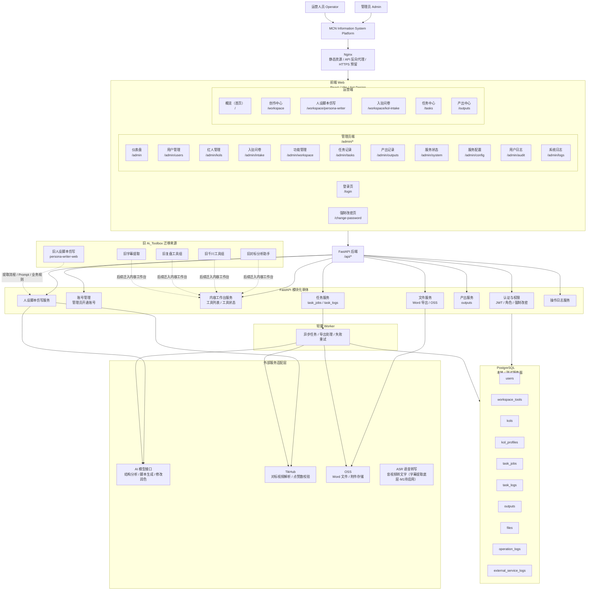

---

## 五、用户与权限设计

### 5.1 账号来源

M1 阶段不开放用户自主注册。

```text
所有账号由管理员在后台统一开通。
```

不做：

```text
手机号注册
短信验证码登录
用户自主申请账号
公开注册入口
```

### 5.2 用户角色

| 角色 | 路由入口 | 说明 |
|---|---|---|
| `admin` | `/admin` | 管理员，负责账号、内容工作台配置、任务记录、产出记录 |
| `operator` | `/` | 运营人员，负责进入内容工作台、使用工具、查看自己的任务和产出 |

### 5.3 权限边界

| 功能 | admin | operator |
|---|---:|---:|
| 登录系统 | ✅ | ✅ |
| 访问 `/admin/*` | ✅ | ❌ |
| 创建账号 | ✅ | ❌ |
| 重置密码 | ✅ | ❌ |
| 禁用 / 启用账号 | ✅ | ❌ |
| 查看内容工作台 | ✅ | ✅ |
| 使用内容工具 | ✅ | ✅ |
| 查看全部任务 | ✅ | ❌ |
| 查看自己的任务 | ✅ | ✅ |
| 查看全部产出 | ✅ | ❌ |
| 查看自己的产出 | ✅ | ✅ |
| 导出 Word | ✅ | ✅ |

---

## 六、登录、账号、权限交互图

### 6.1 用户登录流程

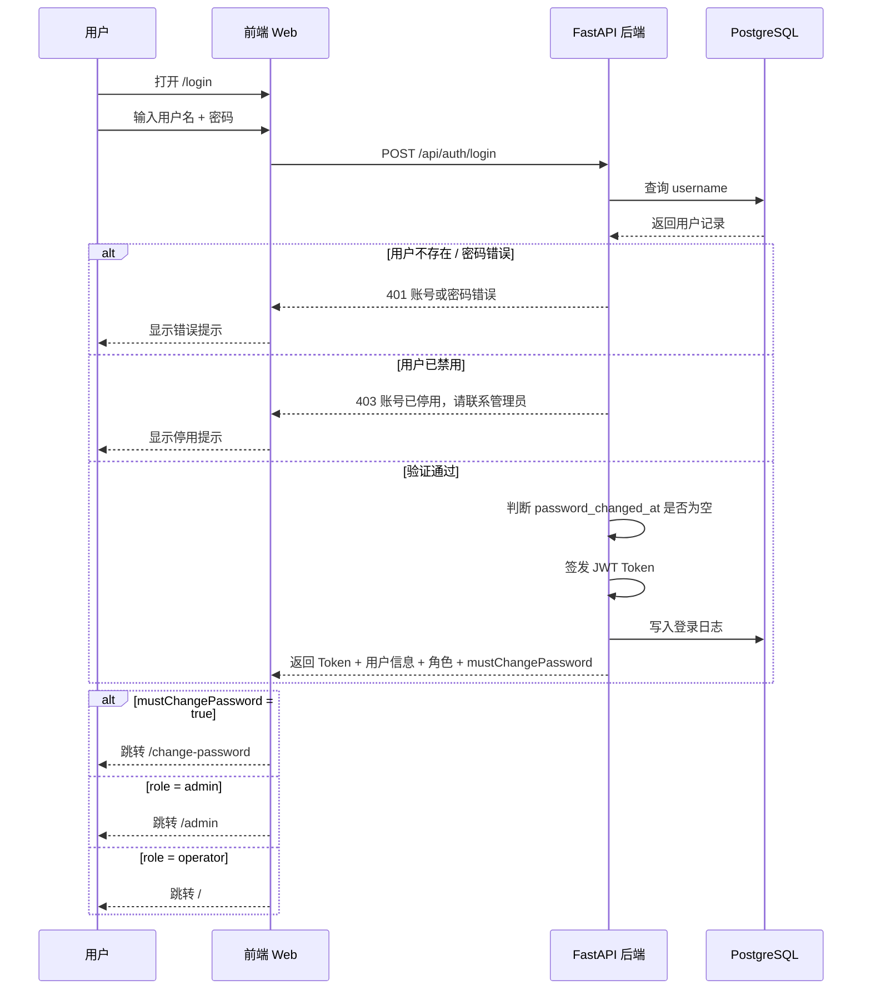

### 6.2 管理员开通账号流程

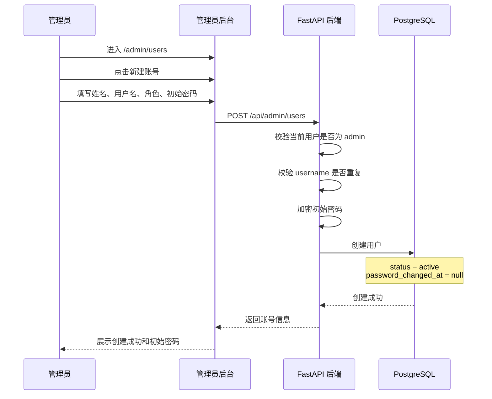

### 6.3 首次登录强制改密流程

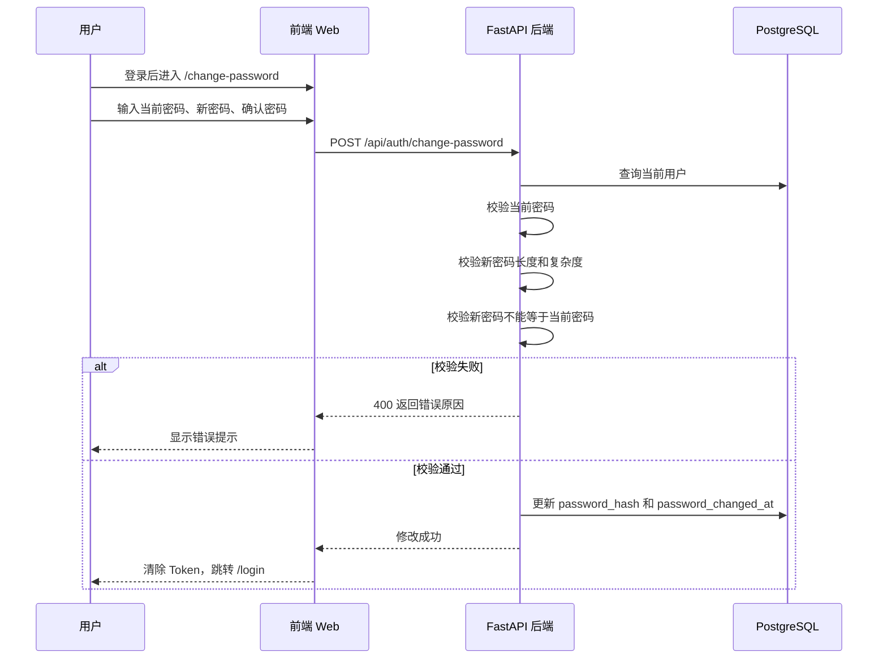

### 6.4 路由权限拦截流程

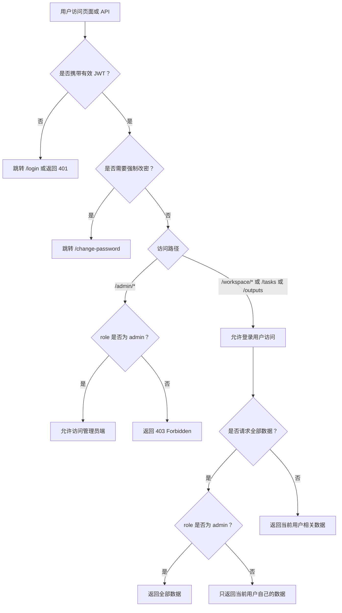

---

## 七、前端页面结构

### 7.1 管理员端 `/admin/*`

```text
功能管理组：
├── /admin                 仪表盘
├── /admin/users           用户管理
├── /admin/kols            红人管理
├── /admin/intake          入驻问卷（题目管理 + AI配置 + 提交记录）
├── /admin/workspace       功能管理（工具上下线配置）
├── /admin/tasks           产品管理（任务记录）
└── /admin/outputs         用户产出

系统管理组：
├── /admin/system          服务状态
├── /admin/config          服务配置（密钥池）
├── /admin/audit           用户日志（操作日志）
└── /admin/logs            系统日志（外部调用日志）
```

数据看板（`/admin`）展示（v2，概览为主，明细分流到各功能页）：

```text
1. KPI：在线用户数（点击→用户管理）/ 今日产出 / 今日工具调用 / 任务成功率
2. 近 7 日内容产出趋势
3. 今日任务概况（成功 / 进行中 / 失败）
4. 外部服务调用（各服务专属指标：AI 型号+Token、TikHub 接口+积分、OSS 文件数+用量、ASR 转写时长）
（“最近产出/在线明细”分别由 产出记录 / 用户管理 承接，不在看板平铺）
```

> 红人管理、服务状态、调用日志、操作日志、服务配置 五页的详细职责见第十六章（v2 增补设计）。

用户管理支持（v2 增强）：

```text
1. 新建账号（自动生成随机初始密码，首登强制改密）
2. 编辑姓名 / 角色 / 状态
3. 重置密码（生成随机一次性初始密码，非固定默认值）
4. 禁用 / 启用账号
5. 删除账号（二次确认，建议软删除）
6. 列表分页（每页 10/20/50）+ 显示账号总数
7. 显示在线时长 / 最近登录；“当前在线”用右侧抽屉承载（不平铺撑页）
```

工具配置（`/admin/workspace`）支持：

```text
1. 查看工具列表
2. 配置工具上线 / 下线状态
3. 查看工具说明
4. 标记工具为：已上线 / 开发中
```

### 7.2 运营端 `/`

```text
/
├── /                              概览（首页）
├── /workspace                     创作中心
├── /workspace/persona-writer      人设脚本仿写
├── /workspace/kol-intake          入驻问卷（运营操作入口）
├── /tasks                         任务中心
└── /outputs                       产出中心
```

运营首页展示（M2 Sprint2 已完成）：

```text
1. 欢迎区：打招呼 +「开始创作」按钮
2. 工作概览卡片（4张）：今日产出 / 本周产出 / 进行中任务 / Token 消耗
3. 内容生成趋势折线图（最近 7 天，recharts）
4. 工具使用占比环形图（本周，recharts）
5. 常用工具快捷入口（最多 6 个，3 列网格）
6. 最近任务列表（5条）
7. 最近产出列表（5条）
```

对应接口：
- `GET /api/operator/homepage/stats` — 4卡片 + 工具占比 + 常用工具
- `GET /api/operator/homepage/trend` — 最近 7 天产出趋势

内容工作台展示工具卡片：

| 工具 | 状态 | 说明 |
|---|---|---|
| 人设脚本仿写 | 已上线 | M1 完成 |
| 红人入驻问卷 | 开发中 | M2 Sprint1，前端待开发 |
| 对标分析助手 | 开发中 | 待排期 |
| 千川工具组 | 开发中 | 待排期 |
| 复盘工具组 | 开发中 | 待排期 |
| 字幕提取 | 开发中 | 待排期 |

---

## 八、内容工作台模块设计

### 8.1 内容工作台定位

内容工作台是 M1 阶段核心业务入口。

```text
内容工作台 = 旧 Ai_Toolbox 内容工具的新统一入口
```

后续旧架构中的十几个内容工具，都逐步迁移到：

```text
/workspace
```

### 8.2 内容工具统一接入规则

所有旧工具迁入内容工作台后，必须遵守：

```text
1. 不再拥有独立登录
2. 不直接访问数据库
3. 不直接调用第三方 API Key
4. 统一调用 FastAPI
5. 任务统一写入 task_jobs
6. 结果统一写入 outputs
7. 导出文件统一写入 files
8. 操作行为统一写入 operation_logs
9. 外部服务调用统一写入 external_service_logs
```

### 8.3 内容工作台入口交互图

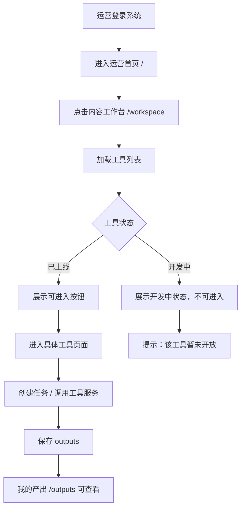

---

## 九、第一个迁移工具：人设脚本仿写

### 9.1 工具基本信息

```text
工具名称：人设脚本仿写
英文标识：persona-writer
旧模块：persona-writer-web
新路径：/workspace/persona-writer
使用角色：admin / operator
M1 状态：上线
```

旧模块三步流程：**Step 1 选择达人、Step 2 对标验证、Step 3 仿写创作，最终导出 Word**。

### 9.2 人设脚本仿写整体交互图

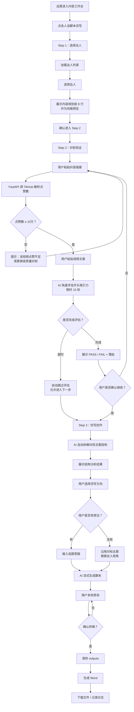

### 9.3 Step 1：选择达人交互图

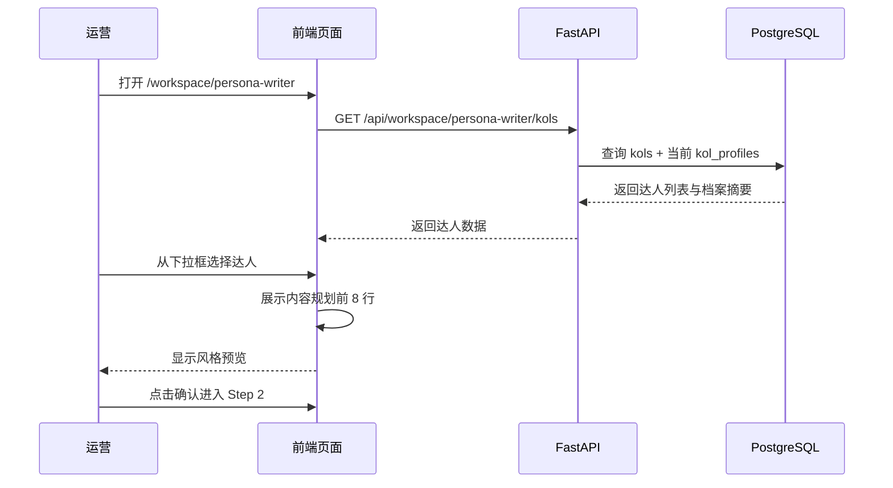

### 9.4 Step 2：对标验证交互图

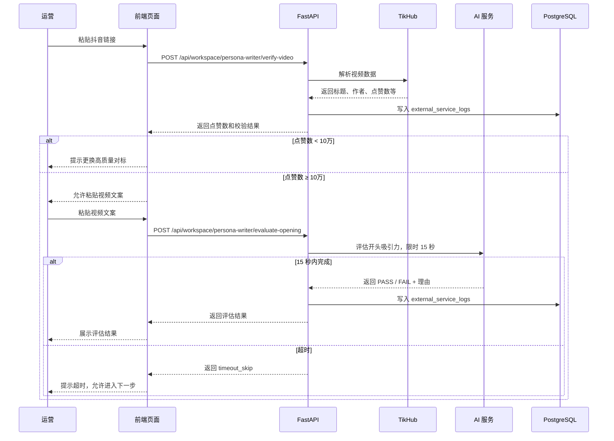

### 9.5 Step 3：仿写创作交互图

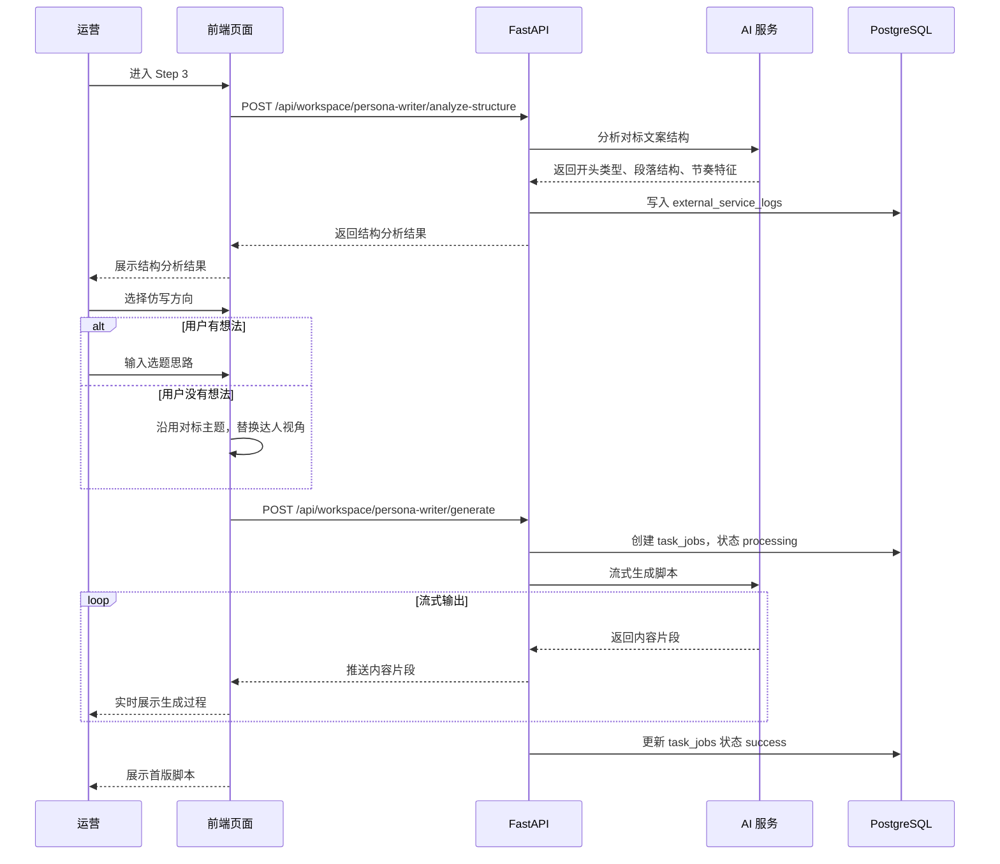

### 9.6 多轮修改交互图

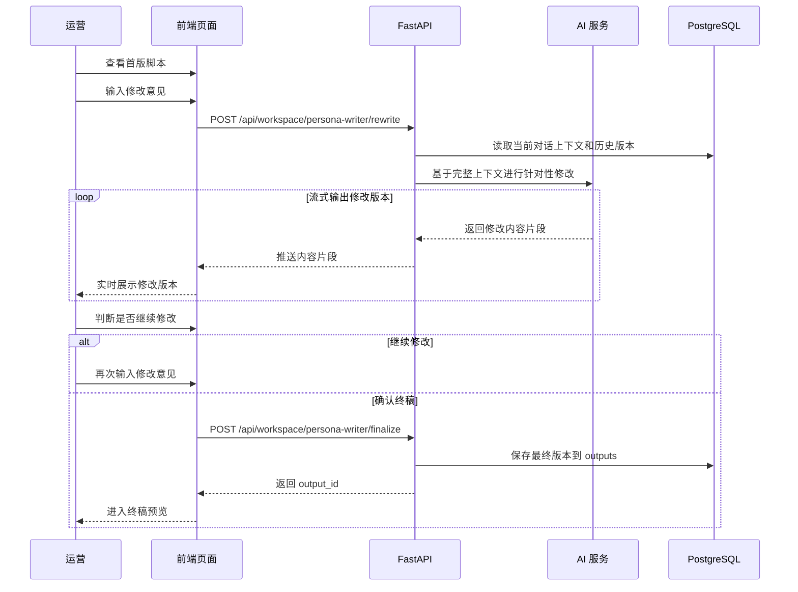

### 9.7 Word 导出交互图

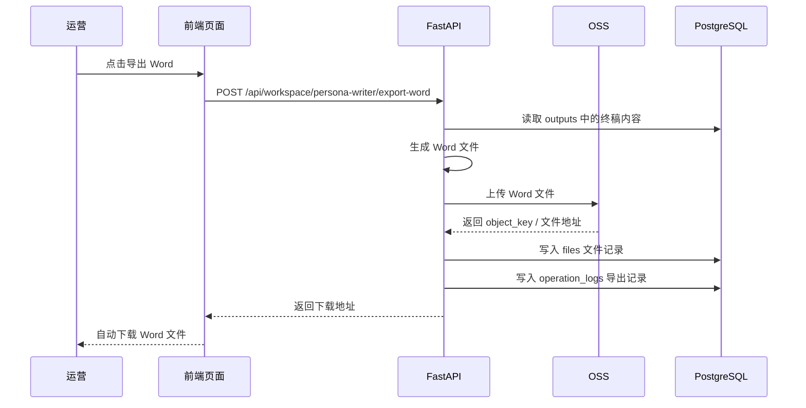

---

## 十、后端 API 设计

### 10.1 认证相关

```text
POST /api/auth/login
POST /api/auth/change-password
GET  /api/auth/me
POST /api/auth/logout
```

### 10.2 管理员账号管理

```text
GET    /api/admin/users
POST   /api/admin/users
PATCH  /api/admin/users/{id}
POST   /api/admin/users/{id}/reset-password
PATCH  /api/admin/users/{id}/status
```

### 10.3 内容工作台

```text
GET /api/workspace/tools
GET /api/workspace/tools/{tool_code}
```

### 10.4 人设脚本仿写

```text
GET  /api/workspace/persona-writer/kols
POST /api/workspace/persona-writer/verify-video
POST /api/workspace/persona-writer/evaluate-opening
POST /api/workspace/persona-writer/analyze-structure
POST /api/workspace/persona-writer/generate
POST /api/workspace/persona-writer/rewrite
POST /api/workspace/persona-writer/finalize
POST /api/workspace/persona-writer/export-word
```

### 10.5 任务和产出

```text
GET /api/tasks/my
GET /api/tasks/{id}
GET /api/admin/tasks

GET /api/outputs/my
GET /api/outputs/{id}
GET /api/admin/outputs
```

---

## 十一、数据库设计

M1 阶段使用：

```text
本地 PostgreSQL / 测试服务器 PostgreSQL
```

暂不使用正式 RDS，后续正式上线前再迁移到阿里云 RDS。

> **v2 变更**：原 `kols` 与 `kol_profiles` **合并为单张 `kols`**（人格档案随基础信息一并维护），核心表由 10 张变 **9 张**；并新增地基期一并创建的两张支撑表 `tool_sessions`、`service_credentials`。完整、可直接执行的字段级建表脚本见 `mcn_m1_schema.sql`，本章只列清单与说明。

### 11.1 M1 核心表（9 张）

```text
users                  用户账号、角色、密码、状态、在线/软删
workspace_tools        工具配置（含 config 阈值）
kols                   红人：基础信息 + 人格档案 + 抖音号 + 签约人员
task_jobs              工具任务记录（= 一次工具会话，状态五态）
task_logs              任务执行日志
outputs                工具最终产出
files                  Word 导出文件和附件记录（OSS key，下载走签名 URL）
operation_logs         用户操作日志
external_service_logs  AI / TikHub / OSS / ASR 调用日志（含 model/tokens/credits/audio_seconds 等）
```

### 11.2 核心表说明

| 表名 | 说明 |
|---|---|
| `users` | 账号、角色、密码、状态；增 `password_changed_at`(强制改密)、`token_version`(登出失效)、`last_active_at`(在线判定)、`deleted_at`(软删) |
| `workspace_tools` | 工具配置；增 `config JSONB`（如点赞阈值、开头评估超时） |
| `kols` | 红人：`name/category/platform/external_id/avatar_url` + 人格档案 `persona/content_plan/style_notes` + **`douyin_id`** + **`owner_id`(签约人员，外键→users)** + `status/created_by` |
| `task_jobs` | 一次工具会话即一个 job；`status`=pending/processing/success/failed/cancelled；`session_id`→tool_sessions |
| `task_logs` | 任务执行子日志 |
| `outputs` | 工具最终产出 |
| `files` | 导出/附件记录，存 OSS key，下载返回带时效签名 URL |
| `operation_logs` | 用户操作审计（登录、开通账号、导出、上下线工具等） |
| `external_service_logs` | 外部调用日志；扩展 `service/endpoint/model/tokens_in/tokens_out/credits/audio_seconds/duration_ms/status/credential_id` |

### 11.3 地基期一并创建的支撑表（v2）

| 表名 | 说明 |
|---|---|
| `tool_sessions` | **工具会话/草稿持久化**（P0）。承载 step、context(选定红人/对标解析/结构分析)、drafts(草稿版本)、messages(多轮修改)；解决人设仿写刷新即丢的问题 |
| `service_credentials` | **密钥池**。AI/TikHub/ASR 多 key 轮换：provider/label/secret_enc/secret_tail/status(enabled/disabled/cooldown)/weight/quota/fail_count/cooldown_until；OSS 单组凭证不入池 |

---

## 十二、任务与产出统一流程

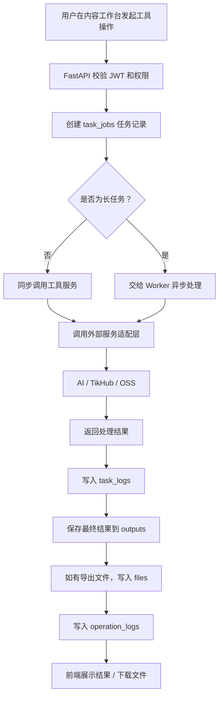

---

## 十三、M1 开发拆分

### M1-1：基础项目搭建

```text
1. 创建 frontend 项目
2. 创建 backend 项目
3. 配置 PostgreSQL
4. 配置 Alembic
5. 配置基础环境变量
6. 配置本地 / 测试服务器 Nginx 转发
```

### M1-2：用户与权限

```text
1. users 表
2. JWT 登录
3. 管理员开通账号
4. 首次登录强制改密
5. admin / operator 权限拦截
6. 登录日志
```

### M1-3：前端基础页面

```text
1. /login
2. /change-password
3. /admin
4. /admin/users
5. /
6. /workspace
7. /tasks
8. /outputs
```

### M1-4：内容工作台基础能力

```text
1. workspace_tools 表
2. 内容工具列表
3. 工具状态：已上线 / 开发中
4. 管理员查看内容工作台配置
5. 运营进入内容工作台
```

### M1-5：人设脚本仿写迁移

```text
1. /workspace/persona-writer 页面
2. Step 1 选择达人
3. Step 2 对标视频点赞校验
4. Step 3 AI 仿写生成
5. 多轮修改
6. 终稿保存 outputs
7. Word 导出 files
8. 操作日志和外部服务日志
```

---

## 十四、M1 验收标准

```text
1. 用户可以访问系统登录页。
2. 系统不开放自主注册。
3. 管理员可以登录后台。
4. 管理员可以创建运营账号。
5. 新账号首次登录必须修改密码。
6. 管理员和运营登录后进入不同页面。
7. 运营不能访问 /admin/*。
8. 管理员可以查看用户管理页面。
9. 管理员可以查看内容工作台配置。
10. 管理员可以查看任务和产出记录。
11. 运营可以进入内容工作台。
12. 内容工作台可以展示工具卡片。
13. 人设脚本仿写工具可以进入。
14. Step 1 可以选择达人。
15. Step 2 可以校验对标视频点赞数。
16. 点赞数低于 10 万时不能进入下一步。
17. AI 可以评估开头吸引力。
18. AI 可以拆解对标文案结构。
19. AI 可以流式生成脚本。
20. 用户可以多轮修改脚本。
21. 终稿可以保存到 outputs。
22. Word 可以生成并下载。
23. 导出文件记录可以保存到 files。
24. 工具调用过程可以写入 task_jobs / task_logs。
25. 外部服务调用可以写入 external_service_logs。
26. 操作行为可以写入 operation_logs。
```

---

## 十五、最终定版结论

M1 阶段正式命名为：

```text
MCN Information System Platform
M1 阶段架构方案：Content Workspace Module / 内容工作台模块
```

M1 核心范围：

```text
内容工作台
+
管理员开通账号
+
管理员端 / 运营端分离
+
本地 / 测试服务器 PostgreSQL
+
统一任务记录
+
统一产出记录
+
AI / TikHub / OSS 服务适配
+
第一个旧工具：人设脚本仿写
```

## 十六、M1 增补设计（v2，原型阶段确认）

> 本章把原型阶段长出、需正式纳入方案的设计统一沉淀。前端展示标准见独立文档《前端设计文档》。

### 16.1 外部服务适配层（含密钥池与 ASR）

- 外部服务由 AI / TikHub / OSS 扩为 **AI / TikHub / OSS / ASR**。ASR 为「字幕提取」工具底层能力，按时长/QPS 计费，M1 为“待启用”（可配密钥、可连通测试，无生产流量）。
- **密钥池**：AI/TikHub/ASR 按 key 限流计费，维护多 key（表 `service_credentials`），策略=轮询/最少使用/权重；遇 429/超额自动 `cooldown` 暂停调度、到点恢复；密钥加密存储、前端仅显示后四位；增删记入操作日志。OSS 单组凭证不入池。M1 为进程内轻量池（单实例），多实例再引 Redis。
- **失败/超时/重试**：每次外部调用统一 `success/timeout/failed` 三态并写日志；按 key 的 `retry` 重试，耗尽置 job `failed` 并回显可读错误。

### 16.2 运维可观测层（管理员四页）

| 页面 | 路由 | 数据来源 |
|---|---|---|
| 服务状态 | `/admin/system` | 健康总览（成功率推算状态灯）+ 24h 调用趋势 + 资源配额消耗 |
| 调用日志 | `/admin/logs` | `external_service_logs` 明细（按服务/状态/任务筛选） |
| 操作日志 | `/admin/audit` | `operation_logs` 明细 |
| 服务配置 | `/admin/config` | `service_credentials` 密钥池增删/停用 + 并发/超时/重试 |

健康灯轻量方案：按最近 N 分钟成功率推算（≥98% 正常 / 80–98% 降级 / <80% 异常 / 无凭证或未上线为待启用），不引独立监控栈。

### 16.3 会话持久化（人设仿写）

人设仿写多步且含多轮修改，新增 `tool_sessions` 承载进行中会话与草稿：`generate/rewrite` 每轮落库，`finalize` 写 `outputs` 并回填 `output_id`。运营首页“进行中的草稿/继续”依赖此表。

### 16.4 红人管理（`/admin/kols`）

- 维护红人基础信息、人格档案；列表 + 新建/编辑/归档。
- 新增字段：**抖音号 `douyin_id`**；**签约人员 `owner_id`**（下拉选用户管理在职员工，存员工 id，支持按员工反查名下红人）。
- 选达人步骤只展示 `status=active` 的红人。

### 16.5 安全与账号（后端强制）

- `mustChangePassword`：`password_changed_at IS NULL` 的 token 除改密/me/logout 外一律 403。
- JWT 生命周期：短期 access + refresh，或 `token_version` 自增使旧 token 失效。
- 重置密码=随机一次性初始密码（非固定值）；删除账号建议软删除。
- OSS 下载返回带时效签名 URL，不暴露公开地址。

### 16.6 API 增量（汇总）

```text
GET  /api/admin/dashboard                  看板聚合（在线/产出/调用/各服务专属指标）
GET  /api/admin/online-users               当前在线（含在线时长）
GET  /api/admin/users?page=&size=          用户分页（items+total）
POST /api/admin/users/{id}/reset-password  随机重置
DELETE /api/admin/users/{id}               删除（软删）
GET/POST/PATCH/DELETE /api/admin/kols       红人管理（含 douyin_id/owner_id）
GET  /api/admin/users/{id}/kols            反查员工名下签约红人
GET  /api/admin/system/services            服务健康+趋势+配额
GET  /api/admin/external-logs              调用日志
GET  /api/admin/operation-logs             操作日志
GET/POST/PATCH/DELETE /api/admin/credentials 密钥池
POST /api/admin/credentials/{id}/test      密钥连通性测试
POST /api/workspace/sessions               创建工具会话
GET/PATCH /api/workspace/sessions/{id}     读取/更新会话与草稿
POST /api/workspace/sessions/{id}/generate 流式生成（SSE）
POST /api/workspace/sessions/{id}/rewrite  多轮修改（SSE）
POST /api/workspace/sessions/{id}/finalize 定稿写 outputs
GET  /api/outputs/{id}/download            返回签名 URL
POST /api/auth/refresh | /api/auth/logout  token 刷新/失效
```

### 16.7 落地优先级

P0：`tool_sessions`、`mustChangePassword` 后端强制、JWT 失效、外部调用三态/重试。
P1：密钥池、运维四页、日志扩展与看板聚合、用户分页/在线/删除、红人管理与两字段、OSS 签名 URL。
P2：ASR 适配（随字幕提取上线）、阈值配置化。

---

一句话总结：

```text
M1 不是完整 MCN 平台，而是先建设”内容工作台”底座，把旧 Ai_Toolbox 的内容工具统一迁入新平台；短视频和直播作为后续独立模块，不在 M1 阶段展开。
```

---

## 十七、M2 阶段设计（当前进行中）

### 17.1 M2 Sprint 1 — 红人入驻问卷（kol-intake）

**核心流程：**
```
运营生成一次性链接
  ↓
博主打开链接 → AI 对话式采集信息（24 道题）
  ↓
博主点击「生成报告」→ 后台异步生成评估报告
  ↓
博主下载报告（docx / PDF）
运营查看对话记录 + 报告
```

**新增数据库表（4 张）：**

| 表名 | 用途 |
|------|------|
| `kol_intake_questions` | 24 道题目配置（AI 对话引导提纲） |
| `kol_intake_configs` | AI 配置（对话模型 + 报告生成模型） |
| `kol_intake_links` | 一次性分享链接 |
| `kol_intake_submissions` | 对话记录与生成报告 |

**新增路由：**

| 路由文件 | 前缀 | 说明 |
|----------|------|------|
| `intake_public.py` | `/api/intake` | 公开接口（无鉴权），博主使用 |
| `operator_intake.py` | `/api/operator/intake` | 运营端接口 |
| `admin_intake.py` | `/api/admin/intake` | 管理员接口（题目管理 + AI 配置） |

**AI 配置：**
- 对话模型：`claude-haiku-4-5-20251001`，max_tokens=300
- 报告生成模型：`claude-opus-4-6`，extended thinking budget=6000
- 工具状态：`dev`（前端开发完成后上线）

**完成状态：** 后端 ✅ 运维 ✅ 前端 ⏳（等设计稿）

---

### 17.2 M2 Sprint 2 — 运营端首页重设计

**新增接口：**

| 方法 | 路径 | 说明 |
|------|------|------|
| GET | `/api/operator/homepage/stats` | 4卡片数据 + 工具使用占比 + 常用工具 |
| GET | `/api/operator/homepage/trend` | 最近 7 天产出折线图 |

**新增路由文件：** `operator_homepage.py`

**完成状态：** 后端 ✅ 前端 ✅
