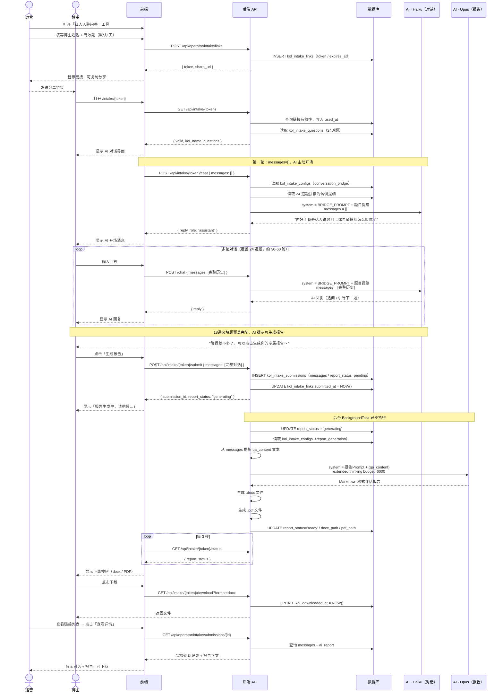
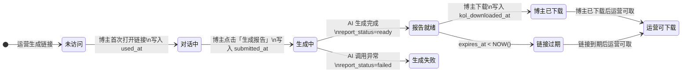
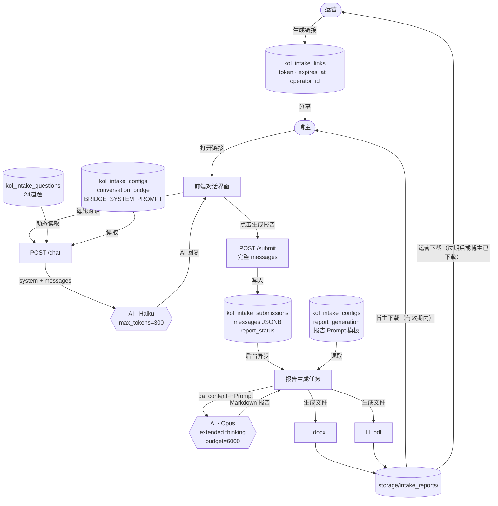

# 红人入驻问卷（kol-intake）完整功能流程

> 文档类型：PM 功能说明  
> 生成时间：2026-06-08  
> 阶段：M2 Sprint 1

---

## 流程图总览

### 图一：完整时序图（系统交互）



---

### 图二：提交状态机



---

### 图三：数据流向图



---

## 一、整体流程概览

```
【运营端】
  登录后台 → 打开「红人入驻问卷」工具
  → 填写博主姓名 + 设定有效期（默认1天）
  → 生成一次性分享链接
  → 复制链接发给博主（或自己填写）

【博主端（无需登录）】
  打开链接 → 进入 AI 对话界面
  → AI 主动开场，引导博主逐步回答 24 道问题
  → 博主与 AI 来回对话（多轮，AI 追问引导）
  → 所有必填题覆盖后，AI 提示可以生成报告
  → 博主点击「生成报告」
  → 等待报告生成（异步，约 30-60 秒）
  → 在有效期内下载报告（docx / PDF）

【运营端】
  链接列表查看状态（未访问 / 对话中 / 已提交 / 已下载）
  → 查看博主完整对话记录
  → 查看 AI 评估报告
  → 链接过期后可下载报告
```

---

## 二、运营端操作流程

### 2.1 生成分享链接

**入口**：内容工作台 → 红人入驻问卷

**操作**：
1. 点击「生成链接」
2. 填写博主姓名（选填，填了会在对话页预填展示）
3. 选择有效期（1天 / 3天 / 7天，默认1天）
4. 点击确认 → 生成链接

**后端接口**：`POST /api/operator/intake/links`
```json
请求：{ "kol_name": "张三", "expires_hours": 24 }
响应：{ "id": 1, "token": "xxxx", "share_url": "/intake/xxxx", "expires_at": "..." }
```

**数据库写入**：`kol_intake_links` 新增一条记录
```
token        = secrets.token_urlsafe(32)（唯一随机字符串）
operator_id  = 当前运营的 user_id
kol_name     = "张三"
expires_at   = NOW() + 24小时
used_at      = NULL（博主首次访问后写入）
submitted_at = NULL（博主提交后写入）
```

---

## 三、博主端对话流程

### 3.1 打开链接

**后端接口**：`GET /api/intake/{token}`

后端验证：
- token 不存在 → 返回 404
- `expires_at < NOW()` → 返回 410（链接已过期）
- `submitted_at IS NOT NULL` → 返回 `already_submitted: true`（已提交，只读展示）
- 正常 → 返回题目列表 + 博主姓名

同时：写入 `kol_intake_links.used_at = NOW()`（仅首次）

---

### 3.2 AI 对话过程

**后端接口**：`POST /api/intake/{token}/chat`

**每次调用传入**：完整对话历史 `messages` 数组  
**后端返回**：AI 的下一句话

#### 第一轮（AI 开场）

前端发送：
```json
{ "messages": [] }
```

后端组装调用参数：
```
system  = BRIDGE_SYSTEM_PROMPT + 24道题目提纲（见第四节）
messages = []
model   = claude-haiku-4-5-20251001
max_tokens = 300
```

AI 返回示例：
```
"你好呀！我是达人说的内容顾问，今天想跟你聊聊你的经历和想法，
 帮我们更好地了解你。不用紧张，就当朋友聊天～
 先来个开场：你希望粉丝怎么叫你？"
```

前端将此条消息存入本地 messages 数组：
```json
[{ "role": "assistant", "content": "你好呀！…", "ts": "2026-06-08T10:00:00Z" }]
```

#### 后续轮次

博主输入回答，前端追加到 messages，再次调用：
```json
{
  "messages": [
    { "role": "assistant", "content": "你好呀！…" },
    { "role": "user",      "content": "叫我小红就好" }
  ]
}
```

后端同样组装完整 system prompt + 传入完整 messages，返回 AI 下一句。

AI 会根据回答追问，例如：
```
"小红，好名字！那你的抖音账号名是什么呀？方便我们查一下你的主页。"
```

#### 对话进行中（覆盖 24 道题）

AI 按照题目提纲逐步引导，对话来回约 30-60 轮。

对于 `multi_collect` 类型的题目（题16、23、24），AI 会引导博主说多条：
```
AI："说说你经历过的、大多数人没经历过的事，先说第一件！"
博主："我大学时候创业失败过，亏了20万"
AI："哇，这段经历挺难得的。还有第二件吗？"
博主："还有一次……"
AI："你的经历真的很丰富！还有第三件吗？或者我们继续下一个话题也可以～"
```

#### AI 判断覆盖完毕后提示

当所有18道必填题都覆盖后，AI 主动提示：
```
"聊了这么多，我对你有了很深的了解。你的信息我这边都记下了！
 现在可以点击下方的「生成我的分析报告」，我来帮你生成一份专属评估报告 ✨"
```

前端此时显示「生成报告」按钮。

---

### 3.3 提交并生成报告

博主点击「生成报告」按钮。

**后端接口**：`POST /api/intake/{token}/submit`
```json
请求：{
  "messages": [
    { "role": "assistant", "content": "…" },
    { "role": "user",      "content": "…" },
    ...（完整对话历史，30-60条）
  ]
}
```

**数据库写入**：
```
kol_intake_submissions：
  link_id        = 对应链接的 id
  messages       = 完整对话历史 JSONB
  report_status  = 'pending'

kol_intake_links：
  submitted_at   = NOW()
```

后端立即返回：
```json
{ "submission_id": 5, "report_status": "generating" }
```

同时触发后台异步任务（见第五节报告生成流程）。

---

### 3.4 轮询报告状态

前端每 3 秒调用一次：

**后端接口**：`GET /api/intake/{token}/status`

```json
响应：{ "report_status": "generating", "download_ready": false }
// 生成完成后：
响应：{ "report_status": "ready", "download_ready": true }
```

---

### 3.5 下载报告

报告生成完成后，前端显示下载按钮。

**下载接口**：`GET /api/intake/{token}/download?format=docx` 或 `?format=pdf`

条件：链接未过期 + `report_status='ready'`

下载后写入：`kol_intake_submissions.kol_downloaded_at = NOW()`（仅首次）

---

## 四、Prompt 完整内容

### 4.1 对话阶段 Prompt（BRIDGE_SYSTEM_PROMPT）

**使用时机**：每次调用 `/chat` 接口时，作为 system 消息发给 AI  
**来源文件**：旧架构 `prompts/kol-intake.ts` → `BRIDGE_SYSTEM_PROMPT`  
**存储位置**：`kol_intake_configs` 表，`config_key='conversation_bridge'`，`system_prompt` 字段  
**使用模型**：`claude-haiku-4-5-20251001`，`max_tokens=300`

```
你是一个红人孵化团队的面试官，正在和一个新红人聊天了解他/她的情况。
你的风格：温暖、真诚、有洞察力，像一个聊得来的朋友。
- 回应要具体到用户说的内容，不要用万能回复
- 语气自然口语化，不要太正式
- 简洁，整体不超过3句话
- 不要用"好的""收到""了解"这种客服话术开头
- 不要用emoji
- 如果用户说了很厉害的经历，真诚地表达惊叹，但不要夸张
- 如果用户说了痛苦的经历，表达理解但不要过度同情
- 不要重复用户说过的内容，直接回应你的感受和观察
```

**后端追加的题目提纲**（每次 `/chat` 时动态从 DB 读取拼接到 system_prompt 末尾）：

```
【访谈提纲 - 需覆盖所有★必填项后再提示生成报告】

基本信息
★ 1. 你希望粉丝怎么叫你？
★ 2. 你的抖音账号名叫什么？
★ 3. 年龄和所在城市？

生活与家庭
★ 4. 你现在的情感状态是？
★ 5. 有小孩吗？几个、多大？
★ 6. 和父母的关系怎么样？用一两句话说说。

野心评估
★ 7. 你现在的直播频率是怎么样的？一周几次、每次多久？
★ 8. 能接受搬家到北京/杭州/广州吗？
★ 9. 你现在每天的时间大概怎么安排的？从早到晚说说。

人品评估
★ 10. 你上一份工作或合作是怎么结束的？
★ 11. 有没有跟人合伙或合作分钱的经历？最后怎么处理的？
★ 12. 有没有一次你觉得被不公平对待的经历？你当时怎么做的？
★ 13. 你觉得什么样的人你绝对不会合作？

职业经历
★ 14. 用一句话介绍你自己——你会怎么跟陌生人说？
★ 15. 你的职业路线是什么？做过什么、怎么走到今天的？

独特经历（★★★ 最重要）
★ 16. 说 1-3 件你经历过的、大多数人没经历过的事。先说第一件！

个性与表达
★ 17. 你说话最大的特点是什么？举一句你经常说的话或口头禅。
★ 18. 有没有你绝对不会说的话、绝对不想做的内容？

特殊背书与资质（选填）
  19. 有没有什么很厉害的证书、头衔、或者听起来就让人"哇"的背景？

内容方向（选填）
  20. 你想靠什么让观众记住你？
  21. 你最想影响什么样的人？
  22. 有没有你喜欢的博主？请给出 ta 的抖音号并说说喜欢/不喜欢什么？

加分项（选填）
  23. 发 1-3 条你在全抖音上最喜欢的视频链接。
  24. 发 1-3 条你自己账号上最满意的视频链接。
```

---

### 4.2 报告生成 Prompt（buildIntakeReportPrompt）

**使用时机**：博主提交后，后台异步生成报告时调用一次  
**来源文件**：旧架构 `prompts/kol-intake.ts` → `buildIntakeReportPrompt` 函数  
**存储位置**：`kol_intake_configs` 表，`config_key='report_generation'`，`system_prompt` 字段  
**使用模型**：`claude-opus-4-6`，extended thinking `budget_tokens=6000`

模板内容（`{qa_content}` 为占位符，运行时替换为对话提炼内容）：

```
你是一个红人孵化团队的资深分析师。以下是一位新红人的信息采集结果，请生成一份分析报告。

## 重要：措辞要求

这份报告会同时给红人本人和团队看，所以措辞必须：
- 像朋友在帮你分析，不要像在写评估报告
- 不要出现「评估」「人品」「野心」「风险」这类字眼
- 涉及投入程度时，用关心的语气引导思考
- 涉及合作风格时，用建设性的方式表达
- 有分析深度但不伤人——问题要点到，但语气是善意的提醒而不是下判断

## 报告结构

# 新红人分析报告 · [昵称]

## 人物画像
（2-3句话总结这个人是谁、核心特质是什么）

## 人格标签
（3-5个关键词，如：务实型创业者 / 毒舌但真诚 / 逆袭叙事）

## 核心差异化素材
（从经历中提炼 2-3 个最有内容价值的素材点）

## 表达风格
（说话特点、语气、内容底线）

## 投入节奏与准备度
（基于直播频率、日程安排、搬家意愿分析现在的投入状态）

## 合作适配度
（基于过去工作/合作经历，分析合作风格）

## 内容方向建议
（基于经历和偏好，建议 2-3 个内容方向）

## 还可以聊的
（还有哪些方面值得进一步了解）

===采集信息===
{qa_content}
===

请用简洁自然的中文输出。语气真诚、温和、有洞察力。
```

**`{qa_content}` 的生成方式**（后端从对话历史提炼）：

```
后端遍历 messages 数组，
提取出 user 消息，结合上一条 assistant 消息确认对应问题，
格式化为：
  "你希望粉丝怎么叫你？→ 小红
   你的抖音账号名？→ @xiaohong_douyin
   年龄和所在城市？→ 28岁，成都
   …"
```

---

## 五、报告生成完整流程

```
博主点击「生成报告」
  ↓
POST /api/intake/{token}/submit（传入完整 messages）
  ↓
后端写入 kol_intake_submissions（report_status='pending'）
写入 kol_intake_links.submitted_at
  ↓
立即返回 { submission_id, report_status: "generating" }
  ↓
【后台异步任务 generate_intake_report(submission_id)】
  ↓
① report_status = 'generating'，commit
  ↓
② 读取 kol_intake_configs WHERE config_key='report_generation'
   获取：system_prompt 模板、ai_model_id → 查 ai_models 取 model_name/provider
  ↓
③ 从 messages 中提炼 qa_content 文本
  ↓
④ system_prompt 中 {qa_content} 替换为实际内容
  ↓
⑤ 调用 yunwu_adapter.chat()
   model = claude-opus-4-6
   provider = yunwu
   extra_body = {"thinking": {"type": "enabled", "budget_tokens": 6000}}
   （若 API 返回 400/422 则去掉 extra_body 降级普通调用）
  ↓
⑥ ai_report = AI 返回的 Markdown 报告文本
   ai_report_raw = 完整原始响应（含 usage token 数）
  ↓
⑦ generate_docx() → storage/intake_reports/{id}.docx
   generate_pdf()  → storage/intake_reports/{id}.pdf
  ↓
⑧ report_status = 'ready'
   report_generated_at = NOW()
   docx_path / pdf_path = 文件路径
   commit
  ↓
【前端轮询 /status 发现 ready，显示下载按钮】
```

---

## 六、数据存储结构

### 6.1 四张核心表关系

```
kol_intake_questions        kol_intake_configs
（24道题，AI引导提纲）        （对话/报告 AI 配置）
         ↑                           ↑
         │ 动态读取                   │ 动态读取
         │                           │
kol_intake_links ──────────────→ kol_intake_submissions
（一次性分享链接）    1:1             （对话历史 + 报告）
```

### 6.2 kol_intake_questions 字段说明

| 字段 | 类型 | 说明 |
|------|------|------|
| order_num | int | 排序号（AI 按此顺序引导） |
| category | varchar | 分组标题 |
| question_text | text | 题目内容 |
| question_type | varchar | text / multi_collect |
| max_items | int | multi_collect 时最多收集几条（题16/23/24为3） |
| is_required | bool | 必填题 AI 必须覆盖，选填题可跳过 |
| is_active | bool | 软删除，关闭后 AI 不再引导此题 |

### 6.3 kol_intake_submissions 字段说明

| 字段 | 类型 | 说明 |
|------|------|------|
| messages | JSONB | 完整对话历史 `[{role, content, ts}]` |
| ai_report | text | 报告正文（Markdown） |
| ai_report_raw | JSONB | AI 原始响应（含 token usage） |
| report_status | varchar | pending / generating / ready / failed |
| docx_path | varchar | docx 文件相对路径 |
| pdf_path | varchar | PDF 文件相对路径 |
| kol_downloaded_at | timestamptz | 博主首次下载时间 |
| operator_downloaded_at | timestamptz | 运营首次下载时间 |

### 6.4 messages JSONB 格式示例

```json
[
  {
    "role": "assistant",
    "content": "你好呀！我是达人说的内容顾问…你希望粉丝怎么叫你？",
    "ts": "2026-06-08T10:00:00Z"
  },
  {
    "role": "user",
    "content": "叫我小红就好",
    "ts": "2026-06-08T10:00:35Z"
  },
  {
    "role": "assistant",
    "content": "小红，好名字！你的抖音账号名是什么？",
    "ts": "2026-06-08T10:00:36Z"
  }
  // ... 30-60 条
]
```

---

## 七、下载权限规则

| 下载方 | 可下载条件 |
|--------|-----------|
| 博主 | 链接未过期（`expires_at > NOW()`）且 `report_status='ready'` |
| 运营 | `report_status='ready'` 且（链接已过期 OR 博主已下载过） |

**设计意图**：优先保障博主在有效期内独享下载，链接到期后或博主已下载后运营才能获取，避免提前泄露报告内容给博主看到前。

---

## 八、管理员可配置项

管理员在「服务配置 → 问卷配置」可修改：

| 配置项 | 位置 | 说明 |
|--------|------|------|
| 24道题的题目内容、顺序、必填 | 问卷配置 → 题目管理 | 修改后立即生效（下次对话读取） |
| 对话 AI 模型 | 问卷配置 → AI 配置 → 对话 | 默认 haiku，可换其他模型 |
| 对话 System Prompt | 问卷配置 → AI 配置 → 对话 | 控制 AI 说话风格 |
| 报告生成 AI 模型 | 问卷配置 → AI 配置 → 报告 | 默认 opus，可换其他模型 |
| 报告 System Prompt | 问卷配置 → AI 配置 → 报告 | 控制报告结构和措辞 |
