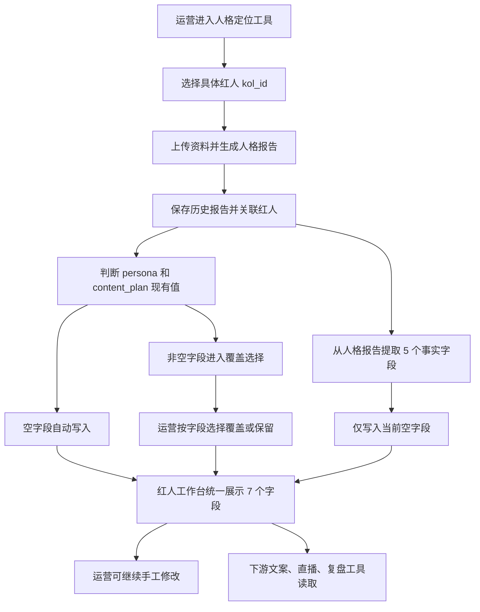

# M2 Sprint 25 红人工作台达人档案统一需求文档 v1

> 编写时间：2026-08-03
> 文档状态：待产品确认
> 对应原型：`docs/pm/prototypes/M2_Sprint25_红人工作台达人档案统一_原型_v1.html`
> 本文档取代《M2_Sprint18-22_红人工作台_需求文档》第四章“人物档案”的五分区单独设计；其他页签需求不受影响。

## 一、需求摘要

将红人工作台的“人物档案”升级为达人档案的唯一正式维护入口，在一个页面内统一管理：

1. **定位策略层**：人格档案 `persona`、内容规划 `content_plan`。
2. **人物事实层**：基本身份、真实经历、关系网、独家经历、其他补充五个字段。

人格定位工具在生成报告前必须绑定具体红人。报告生成后，系统将人格报告和内容规划写入该红人的正式档案：目标字段为空时直接写入，目标字段已有内容时仅询问运营是否覆盖。同时，系统从人格报告提取五个人物事实字段，只补齐空字段，不覆盖人工已维护内容。

## 二、背景与问题

### 2.1 当前数据分层

| 数据 | 存储位置 | 业务含义 | 主要用途 |
|---|---|---|---|
| 人格档案 `persona` | `kols.persona` | 完整人设定位、人物形象和表达方向 | 文案、直播、价值观等工具的风格与立场上下文 |
| 内容规划 `content_plan` | `kols.content_plan` | 选题、内容方向和创作策略 | 选题选择、创作方向和内容约束 |
| 人物档案 5 字段 | `kols.background` 等 | 可以在脚本中使用的具体事实素材 | 替换人物经历、关系、人名和生活细节 |

### 2.2 当前问题

1. 红人工作台只能编辑五个事实字段，看不到完整人格档案和内容规划。
2. 人格档案和内容规划在红人管理、旧素材库等多个页面可编辑，正式入口不唯一。
3. 人格定位工具的生成结果保存在 `persona_reports` 中，但报告没有可靠绑定 `kol_id`，也不会自动写入红人正式档案。
4. 运营需要在多个页面手工复制报告内容，容易造成报告、红人管理和工作台内容不一致。
5. 五个事实字段完全依赖人工填写，没有复用人格报告中已经生成的人物事实。
6. 线上人格定位页虽然有“从 KOL 入驻导入”，但该下拉框读取的是已完成的入驻会话，不是正式达人列表；缺少姓名的会话会显示为“会话_编号”，无法可靠绑定达人。

### 2.3 线上“达人拉取”问题根因

| 当前实现 | 问题 |
|---|---|
| `/api/persona/kol-submissions` 查询 `kol_intake_operator_sessions` | 下拉框实际列出的是入驻会话，不是 `kols` 正式达人 |
| `kol_name` 为空时返回“会话_编号” | 运营无法判断资料属于哪个达人 |
| 查询未按当前运营过滤 | 可能拉到其他运营创建的入驻会话 |
| 前端把会话 `id` 保存为 `selectedKolId` | 变量名称像正式达人编号，实际是入驻会话编号，容易继续误用 |
| 生成请求未携带正式 `kol_id` | 即使导入了入驻资料，生成报告仍无法稳定关联正式达人 |

因此，本期不能只把“会话_编号”改成更友好的文字，而要分清两个对象：

- **目标达人**：来自 `kols`，决定报告和正式档案写给谁。
- **入驻资料**：来自已完成的入驻会话，只是人格分析的输入素材。

## 三、产品目标

### 3.1 目标

1. 让运营在红人工作台一处查看和修改全部七个档案字段。
2. 让新生成的人格定位报告和具体红人形成稳定关联。
3. 减少人格定位结果写入正式档案时的复制粘贴。
4. 防止人工维护内容被人工智能报告静默覆盖。
5. 确保下游文案、直播和复盘工具仍从同一个红人事实源读取上下文。

### 3.2 成功标准

- 所有新生成的人格报告都必须包含明确的 `kol_id`，不允许仅用姓名匹配红人。
- 人格定位页的目标达人必须来自未删除的 `kols`，不得再把入驻会话编号当作达人编号。
- 达人下拉框不再显示“会话_编号”，加载失败必须给出明确提示和重试入口。
- 任何已有内容的 `persona` 或 `content_plan` 都不得在没有运营选择“覆盖”时被替换。
- 人物事实提取仅写入空字段，不改写任何非空人工内容。
- 红人工作台可查看并分别编辑全部七个字段。
- 旧素材库和红人管理不再为普通运营提供并行的正式编辑入口。
- 下游工具能同时获取定位策略层和人物事实层，并保持现有业务逻辑不回归。

## 四、用户与使用场景

### 4.1 主要用户

| 角色 | 主要任务 | 本功能中的权限 |
|---|---|---|
| 运营 | 生成人格定位、维护红人档案、制作文案 | 可生成报告，可决定是否覆盖已有定位字段，可编辑七个档案字段 |
| 管理员 | 管理红人和工具配置 | 可进入红人工作台维护档案；红人管理页不再维护同一份内容 |

### 4.2 核心场景

1. 运营在人格定位工具中选择红人，上传资料并生成人格报告和内容规划。
2. 系统自动写入目标为空的人格档案或内容规划。
3. 如目标已有内容，系统显示字段级覆盖选择，运营可分别决定“覆盖”或“保留”。
4. 系统尝试从新报告提取五个事实字段，只写入红人当前为空的字段。
5. 运营进入红人工作台的“人物档案”，查看并修改七个字段。
6. 文案、直播和复盘工具读取更新后的完整红人上下文。

## 五、名词和数据边界

### 5.1 字段定义

| 展示名称 | 字段 | 层级 | 定义 | 写入规则 |
|---|---|---|---|---|
| 人格档案 | `persona` | 定位策略 | 完整的人设定位、人物形象和表达方向 | 空时自动写入，非空时由运营决定是否覆盖 |
| 内容规划 | `content_plan` | 定位策略 | 选题、内容方向和创作策略 | 空时自动写入，非空时由运营决定是否覆盖 |
| 基本身份 | `background` | 人物事实 | 年龄、职业、背景、性格 | 自动提取只补空值，工作台可人工编辑 |
| 真实经历 | `experience` | 人物事实 | 可替换脚本人物经历的素材 | 同上 |
| 关系网 | `relationships` | 人物事实 | 朋友、闺蜜、家人及关系线索 | 同上 |
| 独家经历 | `unique_story` | 人物事实 | 只有该红人拥有的人生故事 | 同上 |
| 其他补充 | `extra_notes` | 人物事实 | 习惯、口头禅、禁区和表达约束 | 同上 |

### 5.2 唯一事实源

- `kols` 中的七个字段是下游工具使用的正式事实源。
- `persona_reports.profile_result` 和 `persona_reports.plan_result` 是生成历史，不直接替代 `kols` 的正式字段。
- 报告即使未被用于覆盖已有定位字段，仍需保留在历史报告中。
- 下游工具不直接读取最新报告，仍通过统一红人上下文服务读取 `kols` 正式字段。

## 六、整体流程



## 七、功能需求

### 7.1 人格定位工具：沿用线上页面并修正达人绑定

#### 页面位置和改造边界

1. 本功能位于 AI 工具箱的“人格定位”页面，现有路由为 `/workspace/persona-positioning`。
2. 保留线上已有的三步流程：填写达人资料、上传对标资料、生成结果。
3. 保留第一步中的抖音号解析、达人资料、补充信息、文件上传及现有按钮位置。
4. 不新增独立的“人格工具绑定达人”页面，只改造第一步“达人资料（必填）”中的目标达人和入驻资料区域。

#### 目标达人选择

1. “达人资料（必填）”顶部增加“目标达人（必填）”。
2. 目标达人从未删除的 `kols` 正式达人列表读取，选择值必须是 `kols.id`。
3. 支持按达人名称、抖音昵称或抖音号搜索，列表项展示达人名称、账号名称和档案完整度。
4. 未选择目标达人时，不允许进入第二步或开始生成。
5. 达人列表加载失败时显示“达人列表加载失败”及重试按钮，不得像当前代码一样静默隐藏整个区域。
6. 生成请求、生成任务、人格报告和后续档案同步均使用同一个 `kol_id`。

#### 入驻资料导入

1. 将现有“从 KOL 入驻导入”改为目标达人选择后的辅助状态，不再单独显示全部入驻会话下拉框。
2. 选择目标达人后，系统按 `kol_id` 查询该达人已完成的入驻资料：
   - 有资料：展示“已找到最近完成的入驻资料”、完成时间和“导入资料”按钮。
   - 无资料：展示“未找到已关联的入驻资料，可继续上传文件”。
3. 点击“导入资料”后，沿用当前逻辑将格式化问答和人工智能入驻报告加入达人资料文件列表。
4. 入驻资料只是生成输入，不决定报告归属；报告归属始终以目标达人 `kol_id` 为准。
5. 不再返回或展示“会话_编号”；没有 `kol_id` 关联的历史入驻会话不进入人格定位页的达人资料候选。
6. 本期不按姓名自动关联历史入驻会话，避免同名达人和错误资料串用。

#### 数据要求

- `persona_reports` 增加可追溯的 `kol_id` 外键。
- 新建的入驻分享链接和运营直发会话需保留可选的 `kol_id` 关联；只有已绑定正式达人且报告已完成的入驻资料可被人格定位页自动拉取。
- 历史人格报告和历史入驻会话不强制回填 `kol_id`，不做姓名批量匹配。
- 新人格报告必须关联有效、未删除的红人。

#### 修复优先级

| 优先级 | 必须关闭的问题 | 准入要求 |
|---|---|---|
| P0 | 正式达人数据源错误、入驻会话跨运营返回、生成报告未绑定 `kol_id` | 任一项未关闭，不允许进入联合验收 |
| P1 | 搜索体验、账号信息和完整度展示、无入驻资料状态、加载失败重试 | 功能验收前全部完成 |
| P2 | 更丰富的入驻资料历史选择 | 本期不做，默认使用最近完成且已关联的一份 |

### 7.2 人格定位结果：写入与覆盖

#### 写入规则

| 正式字段 | 报告来源 | 当前为空 | 当前非空 |
|---|---|---|---|
| `kols.persona` | `profile_result` | 生成完成后直接写入 | 等待运营选择覆盖或保留 |
| `kols.content_plan` | `plan_result` | 生成完成后直接写入 | 等待运营选择覆盖或保留 |

#### 部分已有内容的情况

- 如 `persona` 非空、`content_plan` 为空：内容规划立即写入，仅询问是否覆盖人格档案。
- 如 `persona` 为空、`content_plan` 非空：人格档案立即写入，仅询问是否覆盖内容规划。
- 如两者均非空：一个对话框内分别展示两个字段，每个字段独立选择“覆盖”或“保留”。
- 关闭对话框等同于对所有待选择字段选择“保留”；已自动写入的空字段不回滚。

#### 交互要求

1. 覆盖对话框显示“现有内容摘要”和“新报告摘要”，但不要求运营审核新内容的正确性。
2. 每个已有字段默认选择“保留原内容”，避免误操作覆盖。
3. 运营确认后执行选择，并返回“已自动写入 / 已覆盖 / 已保留”的字段级结果。
4. 重复点击或重复提交不得产生多次覆盖日志或不一致结果。

### 7.3 人物事实五字段：从报告自动提取

#### 提取规则

1. 人格报告生成完成后，系统从 `profile_result` 提取五个结构化字段。
2. 提取结果必须使用固定字段名：`background`、`experience`、`relationships`、`unique_story`、`extra_notes`。
3. 对每个字段独立判断：
   - 当前为空：写入提取结果。
   - 当前非空：保留当前内容，不弹出逐项确认。
   - 报告未提取出可用内容：保持为空。
4. 不对人格报告中未出现的细节进行补写或推测。
5. 五个字段的人工修改永远高于后续自动提取；非空值视为已维护内容。

#### 失败处理

- 人物事实提取失败不得把人格报告标记为生成失败，也不回滚已经成功写入的 `persona` 或 `content_plan`。
- 红人工作台提供“从最新人格报告补全空字段”操作，用于提取失败后重试或运营清空字段后重新补全。
- 手动补全仍只写入空字段，不覆盖已有内容。

### 7.4 红人工作台：统一人物档案页

#### 页面结构

```text
人物档案
├─ 页头：红人姓名、七项完整度、上次更新时间
├─ 定位与规划
│  ├─ 人格档案
│  └─ 内容规划
└─ 人物事实素材
   ├─ 基本身份
   ├─ 真实经历
   ├─ 关系网
   ├─ 独家经历
   └─ 其他补充
```

#### 交互要求

1. 页面保留当前红人工作台外壳、左侧导航、橙色品牌色和现有信息密度。
2. “定位与规划”放在页面上方，人格档案和内容规划分成两个独立内容区。
3. “人物事实素材”放在下方，保留五个独立编辑区。
4. 每个字段保留独立查看、编辑、保存和取消能力，不使用“一次编辑整页”。
5. 空字段明确显示“待补充”，非空字段显示“已填写”。
6. 人物事实素材标题右侧提供“从最新人格报告补全空字段”按钮。
7. 补全成功后告知运营本次补全了哪些字段，已有字段不展示覆盖询问。
8. 1024×768 与 1440×900 两种尺寸下不得出现横向滚动、内容遮挡或操作按钮移出视口。

### 7.5 重复入口收口

| 页面 | 现状 | 改造后 |
|---|---|---|
| 红人工作台“人物档案” | 只编辑 5 个事实字段 | 成为 7 个字段的唯一正式编辑入口 |
| 红人管理详情 | 可编辑人格档案和内容规划 | 改为只读摘要，提供“前往红人工作台编辑” |
| 旧素材库人格档案/内容规划 | 可编辑并可生成人格档案 | 去除正式编辑与保存入口，保留只读摘要和工作台跳转 |
| 人格定位工具 | 生成报告但不写正式档案 | 报告强绑红人，按本文规则写入正式档案 |

### 7.6 下游工具读取

1. 现有统一红人上下文需继续返回全部七个字段。
2. 注入人工智能提示词时，必须清楚区分：
   - 人格档案：角色定位和表达原则。
   - 内容规划：内容方向和创作策略。
   - 五个事实字段：仅作为可用的具体事实素材。
3. 下游工具不得将人格定位中的抽象表达自动当作真实经历。
4. 本期不改变下游工具的页面流程，只校验输入上下文和回归结果。

## 八、状态与异常处理

| 场景 | 系统行为 | 用户提示 |
|---|---|---|
| 未选红人即开始生成 | 禁止提交 | “请先选择对应红人” |
| 正式达人列表加载失败 | 保留页面和其他已填内容，允许重试 | “达人列表加载失败，请重试” |
| 已选达人没有关联入驻资料 | 不阻塞文件上传和后续生成 | “未找到已关联的入驻资料，可继续上传文件” |
| 历史入驻会话没有 `kol_id` | 不自动出现在目标达人资料中 | 不展示“会话_编号” |
| 生成期间红人被删除 | 报告保留失败状态，不写入档案 | “对应红人已不存在，本次结果未写入” |
| 报告生成失败 | 不写入任何正式档案字段 | 保持现有失败提示和重试入口 |
| 空字段自动写入失败 | 报告仍保留，返回未写入字段 | “报告已生成，档案同步失败，请稍后重试” |
| 事实提取失败 | 不回滚报告或定位字段 | “报告已生成，人物素材未能自动补全” |
| 覆盖对话框被关闭 | 所有待选择字段保留原值 | 不弹额外错误 |
| 重复提交同一报告 | 按当前最新正式字段重新判断，不重复写入已相同值 | 返回字段级结果 |

## 九、数据与契约变更要求

> 本章是需求层约束，具体接口与数据表契约必须在开发前先更新对应唯一事实源文档。

### 9.1 数据层

- `persona_reports` 新增 `kol_id` 外键，新报告必填，历史报告可为空。
- `kol_intake_operator_sessions` 和 `kol_intake_links` 增加可为空的 `kol_id` 外键；新建入驻任务时如已选正式达人则写入，历史数据保持为空。
- `kols` 已有七个正式档案字段，本期不新增第二套档案表。
- 本期不新增字段级版本表、回滚表或人工智能提取草稿表。
- 所有写入和覆盖操作必须写操作日志，日志需记录红人、报告、字段及动作类型（自动写入 / 覆盖 / 保留 / 补全）。

### 9.2 接口层

开发前需在 `backend/docs/base/MCN_M2_Base_API.md` 明确以下契约：

1. 人格定位页搜索和分页读取正式达人，响应必须使用 `kols.id`。
2. 新建入驻分享链接或运营直发会话时可携带正式 `kol_id`，后端校验达人存在且用户有权访问。
3. 按正式 `kol_id` 读取最近完成且有权限访问的入驻资料，不返回未绑定的历史会话。
4. 人格定位生成请求携带 `kol_id`。
5. 报告生成完成后返回字段级同步状态和待覆盖字段。
6. 对待覆盖字段提交“覆盖 / 保留”决策。
7. 红人工作台获取七字段完整档案。
8. 红人工作台单字段更新。
9. 从最新关联报告补全空事实字段。

### 9.3 权限

- `operator` 和 `admin` 可读取与编辑达人档案。
- 未登录用户不得读取。
- 其他角色不得写入。
- 所有写操作保持强制改密检查和操作日志。

## 十、用户故事与验收标准

### US-01 人格报告绑定红人

**作为**运营，**我希望**生成前选择对应红人，**以便**报告不会被写入错误档案。

**验收标准**：

- 未选红人时生成按钮不可用。
- 达人选择项来自正式 `kols`，下拉项不出现“会话_编号”。
- 达人列表请求失败时页面显示错误和重试入口。
- 入驻资料导入只读取所选 `kol_id` 已关联的完成记录；没有记录时仍可上传资料继续。
- 生成请求、任务、报告和操作日志均可追溯到同一 `kol_id`。
- 同名红人不会互相混淆。

### US-02 空定位字段自动写入

**作为**运营，**我希望**空的人格档案和内容规划在报告生成后直接同步，**以便**减少无意义确认。

**验收标准**：

- 两个字段均为空时不出现覆盖对话框。
- 系统明确告知已写入的字段。
- 刷新红人工作台后可看到相同内容。

### US-03 已有定位字段按字段覆盖

**作为**运营，**我希望**只对已有内容的字段决定是否覆盖，**以便**保留有价值的旧内容。

**验收标准**：

- 待覆盖字段分别显示原内容和新内容摘要。
- 每个字段都能独立选择覆盖或保留。
- 默认保留原内容。
- 未选覆盖的字段内容和更新时间不变。

### US-04 事实字段只补空值

**作为**运营，**我希望**系统利用报告补全空的人物事实，**以便**减少重复整理且不破坏人工内容。

**验收标准**：

- 只有空字段被写入。
- 非空字段在提取前后内容完全一致。
- 不出现逐字段确认对话框。
- 页面告知本次成功补全哪些字段。

### US-05 统一编辑达人档案

**作为**运营，**我希望**在红人工作台维护所有档案内容，**以便**避免在多个页面之间切换。

**验收标准**：

- 页面展示定位策略和人物事实两个分区。
- 七个字段均可独立编辑、保存和取消。
- 任何字段保存失败不影响其他字段。
- 空字段和已填字段在页面上可区分。

### US-06 重复入口收口

**作为**运营，**我希望**所有页面都指向同一份正式档案，**以便**不会误以为多个页面有不同版本。

**验收标准**：

- 红人管理和旧素材库不再出现直接保存人格档案或内容规划的按钮。
- 两个页面可展示读取摘要和“前往红人工作台编辑”。
- 红人工作台保存后，其他页面刷新可看到同一正式内容。

## 十一、非功能要求

1. **数据安全**：任何人工智能写入不得静默覆盖非空人工内容。
2. **可追溯性**：生成、自动写入、覆盖、保留、补全和人工编辑都需写操作日志。
3. **幂等性**：报告同步和事实补全重复调用时，不得重复覆盖或改写非空事实字段。
4. **响应一致性**：非流式接口继续使用平台标准响应信封。
5. **日志脱敏**：日志只记录字段名、动作和对象编号，不记录完整人格文本。
6. **页面兼容**：保持当前红人工作台品牌色、字体、控件尺寸和 8px 以下圆角。

## 十二、范围与不做清单

### 12.1 本期范围

- 人格定位工具沿用线上三步页面，选择并强绑正式红人。
- 修正当前把入驻会话当作达人列表的问题，按 `kol_id` 拉取已关联入驻资料。
- 报告结果写入 `persona` / `content_plan`。
- 字段级覆盖决策。
- 从人格报告提取并只补空的五个事实字段。
- 红人工作台统一七字段展示与编辑。
- 红人管理和旧素材库的编辑入口收口。
- 下游工具上下文回归。

### 12.2 本期不做

- 不对历史人格报告按姓名自动回填红人关联。
- 不对历史入驻会话按姓名自动绑定正式红人。
- 不新增字段级版本历史、差异对比或一键回滚。
- 不对人工智能提取的五字段做逐项人工审核。
- 不用新提取结果覆盖任何非空人物事实字段。
- 不改造工具的文案生成主流程、直播主流程或复盘主流程。
- 不新增红人端自助编辑能力。
- 不自动判断人格报告内容是否正确。

## 十三、风险与应对

| 风险 | 影响 | 应对 |
|---|---|---|
| 运营选错红人 | 报告写入错误档案 | 生成前必选红人，展示账号信息和档案完整度 |
| 入驻会话被误当成正式达人 | 报告无法稳定关联，可能串用资料 | 目标达人只读 `kols`；入驻资料按 `kol_id` 单独查询 |
| 达人列表接口失败但页面静默隐藏 | 运营误以为系统没有达人 | 保留错误状态和重试入口，不吞掉异常 |
| 覆盖操作误触 | 有价值的原档案丢失 | 非空字段默认保留，覆盖必须显式选择 |
| 人物事实被推测 | 下游脚本使用不真实细节 | 提取规则限定“只从报告取值，缺失留空” |
| 多入口仍可写 | 数据持续分叉 | 验收时检查红人管理、旧素材库和工作台三处行为 |
| 提取失败导致整份报告失败 | 运营重复生成、增加成本 | 将报告生成和事实提取设为独立状态，允许单独重试提取 |
| 下游把定位文本当事实 | 文案产生伪经历 | 统一上下文明确分段标识，补下游提示词回归 |

## 十四、交付与验收节奏

### 阶段 A：契约与后端闭环

- 增加报告与红人的绑定。
- 完成定位字段写入、覆盖决策和事实只补空逻辑。
- 完成操作日志、幂等和契约测试。

### 阶段 B：人格定位工具与红人工作台

- 人格定位工具增加红人选择和覆盖交互。
- 红人工作台改为七字段统一页。
- 补全空字段操作可用。

### 阶段 C：入口收口与回归

- 红人管理和旧素材库改为只读/跳转。
- 文案、直播和复盘上下文回归。
- 1440×900 与 1024×768 真实页面验收。

### 联合验收主流程

1. 选择一个七字段全空的测试红人，生成人格报告，验证两个定位字段自动写入和五个事实字段自动补全。
2. 在人格定位页选择有入驻资料的正式达人，验证展示真实达人名称、账号和资料完成时间，不出现“会话_编号”。
3. 选择没有入驻资料的正式达人，验证仍可上传文件继续生成。
4. 人工修改一个事实字段，再生成新报告，验证人工字段未被覆盖。
5. 对已有人格档案和内容规划的红人生成新报告，验证两个字段可分别选择覆盖或保留。
6. 在红人管理和旧素材库查看同一红人，验证无并行编辑入口且内容一致。
7. 从红人工作台进入千川仿写、价值观仿写、直播仿写和复盘，验证七字段上下文均可用。

## 十五、决策记录

| 决策 | 结论 |
|---|---|
| 红人工作台是否成为唯一正式编辑入口 | 是 |
| 人格报告写入前是否审核内容正确性 | 否，仅对非空字段确认是否覆盖 |
| 目标为空时是否确认 | 否，直接写入 |
| 人物事实是否需要逐项确认 | 否 |
| 人物事实提取是否覆盖已有值 | 否，只补空字段 |
| 人格报告如何关联红人 | 生成前必须选择红人，用 `kol_id` 强关联 |
| 是否迁移历史人格报告 | 否 |
| 人格定位是否新增独立页面 | 否，沿用 AI 工具箱现有三步页面 |
| 当前“从 KOL 入驻导入”是否等同绑定达人 | 否，它只是输入资料导入，需要与正式达人选择分离 |
| 正式达人列表读取什么数据 | 读取 `kols`，不得读取入驻会话列表代替 |
| 历史“会话_编号”是否按姓名自动关联 | 否，不猜测、不自动迁移 |

## 十六、原型说明

交互原型：[M2 Sprint 25 红人工作台达人档案统一原型 v1](./prototypes/M2_Sprint25_红人工作台达人档案统一_原型_v1.html)

原型顶部的设计稿控制区可切换四种状态，控制区不属于正式产品页面：

| 原型状态 | 重点验证内容 |
|---|---|
| 人物档案默认态 | 七字段统一展示、完整度、定位与事实分区、补全空字段入口 |
| 字段编辑态 | 单字段编辑、保存和取消，不启用整页编辑 |
| 报告覆盖确认 | 非空字段默认保留并独立选择；空字段自动写入；事实字段只补空值 |
| 工具箱现有页面优化 | 保留线上三步流程；正式达人来自 `kols`，入驻资料按 `kol_id` 单独拉取 |

也可以在原型文件地址后增加查询参数直接打开对应状态：

- `?view=default`：人物档案默认态。
- `?view=editing`：字段编辑态。
- `?view=overwrite`：报告覆盖确认。
- `?view=tool`：工具箱现有页面优化。
- `?view=tool&kol=43`：展示已选择正式达人并找到关联入驻资料的状态。

视觉约束：沿用当前红人工作台的深色导航、橙色品牌色和页面信息密度；使用系统字体、浅灰工作区、白色内容面、细边框、轻阴影和不超过 8px 的圆角，不改造成营销页面。

### 16.1 浏览器渲染证据

| 状态 | 尺寸 | 截图 |
|---|---:|---|
| 人物档案默认态 | 1440×900 | [查看截图](./prototypes/artifacts/M2_Sprint25_达人档案统一_1440x900.png) |
| 人物档案默认态 | 1024×768 | [查看截图](./prototypes/artifacts/M2_Sprint25_达人档案统一_1024x768.png) |
| 字段编辑态 | 1024×768 | [查看截图](./prototypes/artifacts/M2_Sprint25_字段编辑_1024x768.png) |
| 报告覆盖确认 | 1440×900 | [查看截图](./prototypes/artifacts/M2_Sprint25_覆盖确认_1440x900.png) |
| 工具箱现有页面优化 | 1440×900 | [查看截图](./prototypes/artifacts/M2_Sprint25_人格定位页达人选择优化_1440x900.png) |
| 工具箱现有页面优化 | 1024×768 | [查看截图](./prototypes/artifacts/M2_Sprint25_人格定位页达人选择优化_1024x768.png) |
