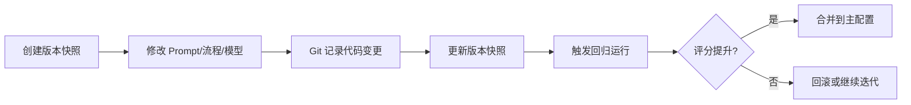
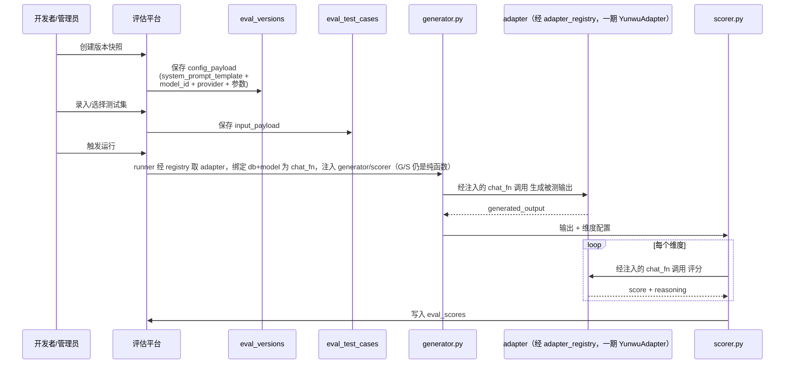
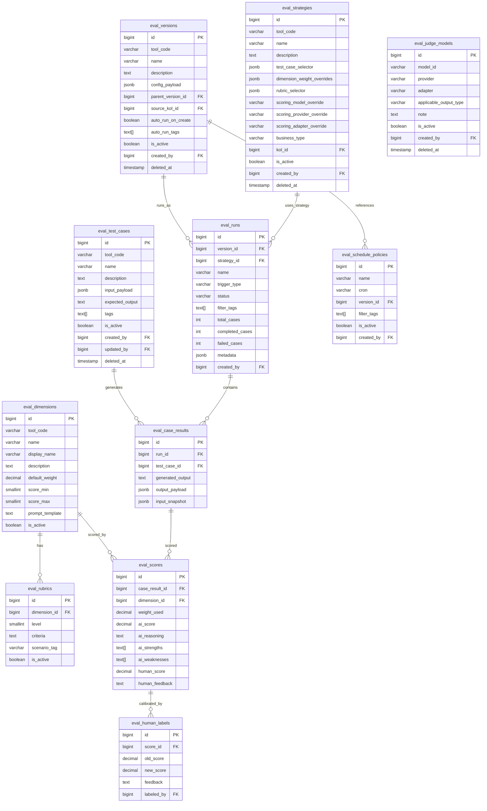

# AIGC 工具回归测试评价体系设计（v2）

> **状态**：设计稿 v2（待评审）  
> **日期**：2026-07-20  
> **背景会议**：0605 视频制作流程探讨、0709 开发工具与工作流优化、**0717 测试体系与自动化开发（周会，v2 主要输入）**  
> **设计目标**：为 New_Mcn_Platform 的 AIGC 工具迭代（先从千川仿写切入）建立可配置的回归测试评价体系，量化追踪提示词/流程版本的效果变化。
>
> **v2 相对 v1 的变更**（v1 = `2026-07-17-aigc-evaluation-system-design.md`，已合入 main，保留不动）：
> 
> 1. **新增策略层 + 超集（Super Set）概念**：对齐工作台「工具超集 → per-KOL 实例子集」的分层模式。评测超集 = test_cases 池 + dimensions 池 + **rubrics 池（分场景细则变体）** + 评委模型候选池 + 默认权重；评测实例配置从超集组合。一期架构预留（默认策略 + 预留 `business_type`/`kol_id` 挂载点），不做配置 UI。
> 2. **分场景评分细则（rubric 变体）**（§2.8.2）：同一维度按业务场景维护多套 level×criteria 细则（如护肤看皮肤刺激/吸收、减肥看是否反弹/饮食），策略按维度挑变体——细则在池子里、策略负责选，不是加 tag。
> 3. **评委模型管理 + 多供应商适配器**（§2.9）：评委模型作为一等概念、**评测自管 model_id（不依赖 ai_models 表）**——新增 `eval_judge_models` 候选池（版本/策略级选用）；引入 `LLMAdapter` 抽象（一期仅 yunwu，预留 Gemini/Kimi 等并行适配器）。
> 4. **工作台分层现状核查**（§2.8.1）：确认现状是扁平 per-KOL 配置，**无业务模板中间层**——决定一期策略层只能做到 per-KOL/默认策略，业务评测策略待工作台自身引入业务模板层后再挂。
> 5. **版本快照一期「关联维护」**（§4.4/§5.4）：保留 `eval_versions` 实体，`config_payload` 来源改为只读调 `workspace_prompt.resolve_prompt` + `kol_context` 抠出最终配置关联固化，不动现有业务模块。
> 6. **评分权重标注 TBD 安雅**，权重独立配置（维度默认 < 版本快照 < 策略层三级覆盖），不硬编码。
> 7. **一期后候选被测对象**补：直播间脚本仿写、价值观仿写。表数 9→11（加 `eval_strategies` + `eval_judge_models`）。

---

## 一、背景与问题

### 1.1 当前痛点

New_Mcn_Platform 中的 AIGC 工具（如千川仿写）目前依靠运营主观评估来迭代提示词和流程：

1. **样本覆盖少**：只看少数经典案例，无法代表全部素材类型。
2. **评分主观**：缺乏稳定、可复现的评分标准，不同人标准不一致。
3. **迭代方向模糊**：调整后不知道整体是变好还是变差，哪些维度改善、哪些恶化。
4. **缺少历史追踪**：每次调整后没有系统化的回归数据沉淀，无法长期观察趋势。

### 1.2 目标

建立一个**评价工具的工具**：

- 用**测试集**覆盖多种输入场景，并支持持续维护。
- 用**版本快照**固定被测工具的某次配置（Prompt + 模型 + 参数）。
- 用**多维评分**量化输出质量，维度标准和提示词可持续迭代。
- 用**版本对比**回答：新版本 vs 旧版本，整体/维度/样本类型上分别如何变化。
- 用**人工校准**修正 AI 评分，沉淀为更高质量的基准数据。
- 用**手动 + 自动调度**支持灵活触发和夜间批量回归。
- 用**生产数据回捞 + 用户反馈通路**持续补充测试集。

### 1.3 用户角色

| 角色 | 人员 | 核心诉求 | 使用功能 |
|------|------|---------|---------|
| **最终用户** | 运营、自营网红 | 使用 AIGC 工具生成内容 | 千川仿写、提交 case 反馈（二期） |
| **开发者/管理员** | 安雅、张翀、郜郜 | 迭代提示词、评估效果、管理测试集 | 维度配置、Prompt 版本快照、运行回归、查看报告、人工校准 |

说明：
- 开发者和管理员是同一批人，不需要做严格的「超级管理员 vs 普通管理员」权限拆分。
- 运营人员主要参与测试集录入、触发运行、人工校准；也可以由开发者/管理员承担。
- 最终用户只接触 AIGC 工具本身，case 反馈是轻量入口。

### 1.4 一期边界

| 维度 | 一期范围 | 未来扩展 |
|------|---------|---------|
| 被测工具 | 千川仿写（qianchuan-writer） | **直播间脚本仿写、价值观仿写**（一期后优先，安雅点名）→ 千川复盘、视频成片、达人表现等 |
| 被测输出 | 脚本文案 | 视频、音频、结构化数据 |
| 测试集来源 | 人工录入（初版 10–12 条，张翀提供、志伟录入） | 从历史 outputs 导入、运行时采集、生产数据 AI 辅助回捞 |
| 工具版本 | 版本快照实体保留，一期**关联维护**（只读抠现有 config 固化） | 完整不可编辑快照 + clone 体系、与 git commit / CI 集成 |
| 评分方式 | AI 初评 + 人工校准 | 外部评分服务、模型微调 |
| 评分维度 | 文案质量、种草力、人设一致性（**权重 TBD 安雅**，占位 0.4/0.35/0.25） | 卖点覆盖、合规安全、结构符合度、信息量等 |
| **评测策略层** | **架构预留**（默认策略 + 预留 `business_type`/`kol_id` 挂载点，不做配置 UI） | per-KOL / 业务策略配置（待工作台引入业务模板层） |
| 调度触发 | 手动触发 + 版本创建/复制后自动触发 + 定时批量 | 与 CI/CD、部署流水线联动 |
| 与现有工作流打通 | 不做打通（评测模块只读复用 `resolve_prompt`/`kol_context`，不改它们） | 轻量/深度打通 |
| 用户 case 反馈 | 不做 | 二期从 AIGC 工具页面提交 |

---

## 二、关键决策

### 2.1 部署方式：集成到现有项目，代码与数据库均独立

**决策**：一期把评价体系作为子模块集成在 `New_Mcn_Platform` 仓库内，但代码、数据库表、前端路由均独立，便于将来平滑拆出。

| 方案 | 优点 | 缺点 | 结论 |
|------|------|------|------|
| ① 集成到现有项目 | 复用鉴权/模型/AI adapter；部署简单；团队摩擦小 | 共享部署单元；未来可能耦合 | **一期选用** |
| ② 独立 Repo | 完全隔离；未来扩展为中台更自然 | 基础设施成本高；数据同步复杂；团队人手紧张 | 未来稳定后考虑 |

**数据库层面**：新增独立的 `evaluation_*` 表，不修改现有业务表，便于将来拆分。

### 2.2 与现有模块的关系

| 现有模块 | 关系 | 是否改动 |
|---------|------|---------|
| `app/routers/operator_qianchuan_writer.py` | 不调用，测试平台自己驱动生成 | ❌ 不改 |
| `app/services/qianchuan_writer_prompt.py` | 可只读复用 `render_system_prompt` | ❌ 不改 |
| `app/services/workspace_prompt.py` | 版本快照「关联维护」复用 `await resolve_prompt(kol_id, tool_code, prompt_key, db)`（async，第 4 参 db）抠红人专属 prompt | ❌ 不改，只读调用 |
| `app/services/kol_context.py` | 版本快照「关联维护」复用 `await get_kol_context(db, kol_id)`（async，第 1 参 db）抠红人人设档案 | ❌ 不改，只读调用 |
| `app/models/kol_workspace_config.py` | 现状工作台配置表（`enabled_tabs`/`prompt_overrides`），策略层设计参照其分层 | ❌ 不改，只读参考 |
| `app/adapters/yunwu.py` | 直接调用进行 AI 生成和 AI 评分 | ❌ 不改 |
| `app/models/kol.py` | 读取达人信息用于测试集录入 | ❌ 不改 |
| `app/models/ai_models.py` | **评测不依赖**——model_id 在评测自己的表里当字符串存（§2.9.1），不读 ai_models | ⊘ 不涉及 |
| `app/models/output.py` | 未来打通时可能关联 | ❌ 一期不改 |
| `app/models/log.py` | 所有写操作必须写 `OperationLog` | ❌ 不改，只写 |
| `backend/tests/conftest.py` | 新模块使用 `AsyncSessionLocal` 需注册 patch | ⚠️ 需新增路径，但不改现有逻辑 |

### 2.3 测试集管理策略

测试集不是一次性导入就结束，而是需要**持续维护**的资产。

#### 管理原则

1. **分类标签化**：每个 test_case 必须带 `tags`，便于按场景筛选和运行。
   - 示例标签：`焦虑型`、`诱惑型`、`美妆`、`护肤`、`钩子前置`、`强种草`、`达人 A`、`618 大促`
2. **版本化维护**：测试集本身不改历史记录，使用 `deleted_at` 做逻辑删除；用 `is_active` 控制是否参与回归。
3. **样本生命周期**：
   - 新增：人工录入典型样本。
   - 退役：当某个样本不再代表当前业务场景时，标记 `is_active=false` 或设置 `deleted_at`。
   - 复用：历史高价值样本可复制为新样本并调整标签。
4. **批量维护**：未来支持 CSV/Excel 批量导入导出；一期先提供单条 CRUD。

#### 测试集规模预估

| 阶段 | 样本数 | 运行成本（每版本） |
|------|--------|------------------|
| 初期 | 10~30 条 | 30×4=120 次 AI 调用 |
| 中期 | 50~100 条 | 100×4=400 次 AI 调用 |
| 长期 | 200+ 条 | 需要按标签子集运行或夜间批量 |

#### 二期：生产数据自动化回捞

未来测试集不仅靠人工录入，还应从生产环境的实际使用中持续补充：

```
生产环境 outputs / task_jobs / 用户反馈
              ↓
    AI 辅助筛选（按质量、多样性、异常值）
              ↓
    候选 case 池（带完整上下文）
              ↓
    开发者/管理员审核后入库
```

回捞标准可由**开发者/管理员**配置：
- 按工具/场景/标签筛选
- 按评分阈值筛选（如 AI 初评分极低或极高）
- 按时间范围筛选（如近 7 天、近 30 天）
- 去重策略（同一输入多次生成只保留最新/最优）

#### 三期：分层次回归策略

提示词迭代后，验证深度从浅到深、速度从快到慢：

```
Layer 1: 开发人员个例手动测试
    ↓ 快速验证无明显问题
Layer 2: 测试体系批量回归测试集
    ↓ 验证整体不恶化
Layer 3: 指定/默认时间范围回归线上 case
    ↓ 验证对真实生产数据的效果
Layer 4: 小流量上线观察 + 用户反馈回收
```

这样把功能迭代和生产环境反馈充分打通。

### 2.4 评分维度与提示词的扩展性设计

评分维度是测试体系的核心，必须设计成**稳定可扩展**的结构。

#### 维度分层模型

```
Dimension（维度）
  └── Rubric（评分标准/细则）
        └── Prompt Template（评分提示词模板）
```

#### 扩展性预留

| 扩展场景 | 设计方案 |
|---------|---------|
| 新增维度（如合规安全） | 新增 `eval_dimensions` + `eval_rubrics` 记录即可 |
| 同一维度不同权重 | `eval_versions.config_payload` 可覆盖维度权重 |
| 不同场景用不同维度组合 | `eval_dimension_sets` 表定义维度组合（未来） |
| 不同达人/品类用不同 rubric | `eval_rubrics` 支持按 `scenario_tag` / `kol_id` 过滤（未来） |
| 动态生成评分 prompt | `rubric` 和 `dimension` 支持变量占位符，由 `rubric_resolver.py` 渲染 |

**`scenario_tag` 的语义与阶段边界**：
- **语义**：`scenario_tag` 标识 rubric 的**业务场景变体**，取值与策略的 `business_type` 对应（如 `skincare`/`diet`/`default`），**不是** test_case 的 tag。
- **一期**：仅作**标记字段**，`rubric_resolver.py` 不参与选择——所有维度统一用 `default` 变体。
- **未来**：由 **策略级 `rubric_selector`**（按 dimension 选 scenario 变体，见 §2.8.2）启用选择，而非运行时按 test_case tag 匹配。一期不做选择，避免评分标准不一致。

一期维度定义（**权重为占位值，TBD 安雅草拟确认**；周会明确权重独立配置、后续好调整）：

| 维度 | name | 含义 | 权重（占位，TBD 安雅） |
|------|------|------|------------|
| 文案质量 | `copy_quality` | 钩子吸引力、叙事流畅度、信息密度 | 0.4 |
| 种草力 | `conversion_power` | 卖点展示、转化驱动、行动引导 | 0.35 |
| 人设一致性 | `persona_consistency` | 是否符合达人 persona / 语言风格 | 0.25 |

**权重独立配置、不硬编码**，有三级覆盖点（优先级：策略层 > 版本快照 > 维度默认）：
1. `eval_dimensions.default_weight`：维度默认权重（上表占位值）。
2. `eval_versions.config_payload.dimension_weights`：版本快照级覆盖（dimension_id 为 key）。
3. `eval_strategies.dimension_weight_overrides`：策略级覆盖（见 §2.8 策略层）。

### 2.5 存储容量规划

每次运行都会产生大量数据，必须提前规划存储。且评估体系未来将复制到 N 个场景，容量需求线性增长。

#### 单场景单次运行数据量估算

设计采用 `eval_case_results` 表归一化存储生成输出，每个 case 的输出只存一次，维度评分引用它。

假设：
- 每个样本平均输入 2,000 tokens
- 每个样本生成输出 1,500 tokens
- 每个维度评分 prompt 3,000 tokens
- 3 个维度

单次运行 100 条样本：

| 数据项 | 单条大小 | 100 条 |
|--------|---------|--------|
| `input_payload` | ~5 KB | ~500 KB |
| `generated_output`（归一化存一次） | ~3 KB | ~300 KB |
| `ai_reasoning` × 3 | ~2 KB | ~600 KB |
| 元数据（tokens、耗时等） | ~1 KB | ~100 KB |
| **单次运行总计** | ~11 KB | **~1.1 MB** |

#### 多场景长期存储预估

| 场景数 | 年运行量 | 年存储 |
|--------|---------|--------|
| 1 个场景 | 每天 5 次 × 100 条 | ~2.0 GB |
| 3 个场景 | 同上 | ~6.0 GB |
| 5 个场景 | 同上 | ~10.0 GB |
| 含历史归档、测试集、人工校准 | 固定 + 动态 | 实际约为上述 1.2~1.5 倍 |

#### 存储优化策略

1. **冷热分离**：3 个月前的 `eval_scores` / `eval_case_results` 可归档到冷存（如 OSS/压缩表），热库只保留近期数据。
2. **output 去重**：同一版本同一测试集的 `generated_output` 不变，但不同 run 仍独立保存（便于追踪）。
3. **定期清理失败/调试运行**：运行记录支持软删除或归档。
4. **JSONB 压缩**：PostgreSQL 自动 TOAST 压缩大字段。
5. **归档表分区**：按 `run_id` 或时间对 `eval_scores` 做分区，便于清理和查询。

### 2.6 用户反馈提交 case 通路（未来规划）

AIGC 工具的最终用户（运营或自营网红）在使用过程中，如果发现某个 case 处理得不好，可以直接提交到测试评价体系：

```
最终用户在使用 qianchuan-writer
        ↓
发现输出不符合预期
        ↓
点击"提交到测试集"按钮
        ↓
系统自动收集：
  - 输入（persona、product_info、messages）
  - 输出（generated_output）
  - 当前版本配置（version snapshot）
  - 用户反馈文本
        ↓
进入候选 case 池
        ↓
开发者/管理员审核后入库
```

这样把用户反馈直接转化为测试集迭代的输入，形成闭环：

```
用户反馈 → 候选 case → 人工审核 → 测试集 → 回归验证 → 工具改进 → 用户反馈
```

一期不做此功能，但数据模型和架构预留扩展点。

### 2.7 评测体系对其他模块的对接要求

一期**不改造**现有模块，但以下对接点需要在后续阶段考虑。本清单用于提前识别改造范围。

| 对接点 | 当前状态 | 一期要求 | 未来改造点 |
|--------|---------|---------|-----------|
| `qianchuan_writer_configs.system_prompt` + per-KOL `prompt_overrides` | 存在 DB 配置表 | **关联维护**：只读调 `resolve_prompt`/`kol_context` 抠出最终配置，固化为版本快照（不改这两个服务） | 提供 API 让测试平台一键导入当前配置 |
| `qianchuan-writer` 版本标识 | 目前只有代码层面的 git 历史 | 测试平台内独立维护版本快照 | 工具模块本身记录 Prompt/流程版本号，与 git commit 关联 |
| `outputs` 表 | 保存用户保存的输出 | 不关联 | 增加 `eval_run_id` 或 `eval_case_id` 字段 |
| `task_jobs` 表 | 记录任务执行 | 不关联 | 运行评测时可关联 task_job，统一追踪 |
| 用户反馈入口 | 无 | 无 | 在 writer 页面增加"提交到测试集"按钮 |
| 实时生成事件 | 流式输出，无事件总线 | 不订阅 | 增加生成完成事件，供评测体系自动采样 |

### 2.8 策略层与超集（Strategy Layer & Super Set）—— v2 新增

> 来源：0717 周会「多工作台适配问题」讨论 + 会后代码核查。这是 v2 相对 v1 的核心架构补充。

#### 2.8.1 工作台分层现状（代码核查结论）

读 `kol_workspace_config.py` / `workspace_prompt.py` / `kol_context.py` / `operator_workspace.py` 后确认：

| 层 | 实现 | 说明 |
|----|------|------|
| **上层：工具池（超集）** | `_DEFAULT_TABS` 13 个工具代码（硬编码）+ 各工具 `*_configs` 表的全局默认 prompt | "全部可用工具 + 全局默认" = 工作台的**超集** |
| **下层：per-KOL 实例配置** | `kol_workspace_configs`（`kol_id` 唯一）：`enabled_tabs`（13 里选子集）+ `prompt_overrides`（`{tool_code:{prompt_key:值}}`） | 每个工作台实例：选哪些 tab + 覆盖哪些 prompt |
| **prompt 覆盖** | `await resolve_prompt(kol_id, tool_code, prompt_key, db)` → 返回 per-KOL override 或 `None`（**不自动 fallback 全局默认，由调用方读 `*_configs.system_prompt` 兜底**，见 §4.4 三步） | 「实例提示词可配置」的机制 |
| **上下文组装** | `await get_kol_context(db, kol_id)` → 该 KOL 完整人设档案 `KolContext` | 各 writer 用它填占位符 |
| **业务模板/策略中间层** | **不存在** | 现状是**扁平 per-KOL 配置**。「跟着业务走」是业务概念，代码里无 `business_type`/模板实体——同业务的两个 KOL 配置各自独立，无共享模板 |

**结论**：张翀说的「工作台上层逻辑与下层实例已经分层」属实（工具池 + per-KOL 实例配置）。但**没有业务模板中间层**。这决定评测策略层一期只能做到「默认策略 + per-KOL/业务挂载点预留」，**业务评测策略**（绑 `business_type` 的 strategy 实例）待工作台自身引入业务模板层后再挂。

#### 2.8.2 评测超集与实例配置（对齐工作台分层）

镜像工作台「工具超集 → per-KOL 实例子集」模式：

```
评测超集（Super Set）
  ├─ 全部 test_cases 池（按 tool_code + tags）
  ├─ 全部 dimensions 池（文案质量/种草力/...）
  ├─ rubrics 池：每个维度下按「业务场景」维护多套评分细则变体（见下）
  ├─ 评委模型候选池（见 §2.9）
  └─ 默认权重（eval_dimensions.default_weight）
        │  策略 = 从超集组合（选 test_case 子集 + 选 rubric 变体 + 覆盖权重 + 选评委模型）
        ▼
评测策略（eval_strategies）  ← 对应工作台的 per-KOL/业务配置
        │  运行
        ▼
eval_runs
```

**分场景评分细则（rubric 变体）——核心机制**：

同一维度，不同业务场景的**评分标准本身就是不同的细则**（不是加个 tag 标签，而是整套 level×criteria 文本不同）。在 `eval_rubrics` 里，每套场景变体 = 同一 `dimension_id` + 同一 `scenario_tag` 的一组 level×criteria 行；策略按维度挑哪一套变体（`rubric_selector`）。`eval_dimensions.prompt_template` 保持通用（含 `{{rubric_text}}` 占位符），场景特定的得分点全部落在 rubric 行里。

举例（文案质量 `copy_quality` 维度，两套场景变体 + 一套默认）：

| dimension | scenario_tag | level | criteria（得分点文本，因场景而异）|
|-----------|--------------|-------|------|
| copy_quality | `skincare` | 10 | 钩子强 + **皮肤刺激/面部吸收**等卖点清晰可信、有使用场景代入 |
| copy_quality | `skincare` | 8 | 钩子较吸引、卖点基本清楚，吸收/刺激点提到但代入一般 |
| copy_quality | `diet` | 10 | 钩子强 + **是否反弹/饮食注意**等风险与效果讲透、情绪到位 |
| copy_quality | `diet` | 8 | 钩子较吸引、效果讲清，反弹/饮食提醒提到但不突出 |
| copy_quality | `default`（NULL） | 10 | 通用文案质量满分标准 |
| copy_quality | `default`（NULL） | 8 | 通用文案质量良好标准 |

`rubric_selector` 示例：护肤业务策略选 `{"1": "skincare", "2": "default", ...}`（**key 为 dimension_id 字符串**，与 `dimension_weight_overrides` 的 key 体系一致，避免维度改名导致映射失效），runner 渲染评分 prompt 时，`{{rubric_text}}` 填入该维度 skincare 那套细则。**评分细则在池子里（超集），策略负责挑哪一套**——细则可跨策略复用，不内嵌进策略 JSONB。

> **注①**：权重实际有**三级覆盖**（见 §2.4）：策略层 `dimension_weight_overrides` > 版本快照 `config_payload.dimension_weights` > 维度默认 `default_weight`。「版本快照权重」是独立于 super set 和策略层的第三层（绑在被测工具配置上），图中未单独画出，runner 取最 specific 的命中值。
>
> **注②**：rubric 变体的「场景」与策略的 `business_type` 对应（如 `skincare`/`diet`）。一期 `scenario_tag`/`rubric_selector` 结构预留、不启用匹配（见 §2.4 阶段边界），所有维度先用 `default` 变体。

#### 2.8.3 一期策略层 = 架构预留（后向兼容）

一期**不做策略配置 UI**，但数据模型与概念**预留**，确保二期加 per-KOL/业务评测策略时不返工：

1. **新增 `eval_strategies` 实体**（见 §5.4）：一个策略 = `tool_code` + `test_case` 子集选择（标签或 ID 列表）+ `dimension_weight_overrides` + `rubric_selector`（按维度选 rubric 场景变体，见 §2.8.2）+ 评委三件套覆盖（`scoring_model_override`/`scoring_provider_override`/`scoring_adapter_override`，见 §2.9）+ 可选 `business_type`/`kol_id` 挂载点。
2. **一期默认策略**：seed 一条 `name='default'` 策略 = 全超集（全部 active test_cases + 维度默认权重），一期所有 run 绑定它。
3. **`eval_runs` 增加 `strategy_id`**（一期恒等于 default 策略），让 run 自带策略上下文，二期切换策略无需改 run 结构。
4. **预留挂载点**：`eval_strategies.business_type` / `kol_id` 可空，一期不建「业务模板」表；将来工作台引入业务模板层，评测策略直接挂上去。
5. **一期 UI 不暴露策略配置**：前端只读展示「当前用默认策略」，配置入口留到二期。

### 2.9 评委模型与多供应商适配器（v2 新增）

> 背景：同样的测试例 + 维度，**不同评委模型打分不同**（glm-4.7 与 glm-5.2、kimi、gemini 是不同模型）。且评委模型的接入**可能走 yunwu，也可能走其他供应商**（未来与 yunwu 并行的适配器）。因此评委模型需作为**一等概念**管理，接入层需抽象、可扩展。

#### 2.9.1 设计原则：评测模块自管模型身份，不依赖 ai_models

评测模块要**独立于现有业务表**（便于将来拆分）。因此：

- **评测代码层面不读 `ai_models`、不读 `credentials`**——模型身份（`model_id`/`provider`/`adapter`）在评测自己的表里当**字符串**存，自包含。（运行时适配器内部会用到 credentials 表拿凭证——那是适配器的职责，不是评测代码读。）
- **实际调 AI 经适配器**（yunwu 等）：评测把 `model_id` 字符串传给适配器，由适配器内部解决凭证/模型路由——这是适配器的职责（共用 AI 网关），**不是评测读 ai_models/credentials**。
- 现有业务模块对 `ai_models`/`credentials` 的用法**完全不受影响**（评测不碰这两张表）。

#### 2.9.2 两层落地

| 层 | 内容 | 落点 |
|----|------|------|
| **① 评委模型登记**（评测自管，新表） | 哪些模型可当评委、版本化（`glm-4.7`/`glm-5.2`/`kimi-k2`/`gemini-2.5` 各算不同 model_id）、适用哪种**内容/输出类型**（文案类→glm/kimi；视频类→gemini/qwen）、走哪个**适配器** | 新增 `eval_judge_models` 表（见 §5.4），`model_id` 当字符串自存、**不 FK 引用 ai_models**；**具体候选清单 = 专项调研 TODO**，一期建表预留、内容后填 |
| **② 选用记录**（版本/策略级） | 某次评测实际用哪个评委（可复现 + 可对比评委差异）| `eval_versions.config_payload.scoring_model_id`+`scoring_provider`+`scoring_adapter`（版本快照固化）+ `eval_strategies` 三个 override（model/provider/adapter，策略级覆盖，策略优先）+ run 启动时 resolve 的实际身份写入 `eval_runs.metadata.resolved_scoring`（见 §2.9.4）|

> `model_id` 只是一个字符串标识（适配器认得即可），评测不校验它是否在 `ai_models` 里存在——评委是否可用由适配器调用时决定。

#### 2.9.3 多供应商适配器抽象（一期简单实现 + 设计预留）

现状：若评委模型**不走 yunwu**（直连 Gemini / 直联 Kimi / 直连 OpenAI），现有架构接不进来。

设计预留：引入 **LLM 适配器抽象**，一期实现仅 yunwu，结构支持并行适配器：

```
LLMAdapter 接口（chat / chat_stream）
  ├── YunwuAdapter        （一期实现，包现有 yunwu_adapter）
  ├── GeminiAdapter       （未来，直连 Gemini）
  ├── KimiAdapter         （未来，直联 Kimi/OpenAI）
  └── ...                 （按需扩展）
        ↑
  adapter_registry.get(adapter_name) → 返回适配器类/工厂
```

**关键：registry 归 runner 用，generator/scorer 仍是纯函数（B-C1 收口）**。`yunwu.chat` 需要 `db`（内部锁凭证），与「generator/scorer 纯函数、不持 session」冲突。解法：

- **runner**（持有 `db`）经 `adapter_registry.get(adapter_name)` 取适配器 → 用 resolve 出的 `model_id`/`provider` 绑定成 `chat_fn` callable → **注入** generator/scorer。
- generator/scorer 只接收 `generate_fn`/`score_fn` callable，**不 import yunwu、不持 db**，保持可纯单测（§6.1/§6.7 不变）。
- 二期加 Gemini/Kimi 适配器：只改 `adapter_registry` 注册 + 新增 adapter 文件，**不动 generator/scorer/runner 的调用代码**。

- `config_payload` / `eval_judge_models` 在 `model_id`+`provider` 之外，**都带 `adapter` 字段**（走哪个适配器，一期取值仅 `"yunwu"`）。
- 一期：registry 只注册 yunwu，行为与现状一致；**抽象层是预留，不增加一期复杂度**。

#### 2.9.4 一期落地（简单）

- 评委模型：用 `config_payload.scoring_model_id` + `scoring_provider` + `scoring_adapter="yunwu"`（版本快照固化，保证可复现）；策略级可用 `eval_strategies` 的三个 override 覆盖（见 §5.4）。
- **评委身份持久化（B-C2）**：run 启动时 runner 把 **resolve 出的实际评委身份**写入 `eval_runs.metadata.resolved_scoring = {model_id, provider, adapter}`，保证「可复现 + 可对比评委差异」——即使后续 strategy/version 被改或软删，历史 run 的评委身份仍可查。
- `eval_judge_models` 表：**建表（结构预留），一期 seed 极简或不 seed**，候选池二期填、专项调研产出候选清单。
- `adapter_registry`：一期只有 yunwu 一个实现，接口定义好。

---

## 三、架构与模块边界

### 3.1 后端模块

```
backend/app/evaluation/
├── __init__.py
├── models/                      # 数据模型（全部新增表）
│   ├── dimension.py             # eval_dimensions：评分维度定义
│   ├── rubric.py                # eval_rubrics：维度下的评分标准/细则
│   ├── test_case.py             # eval_test_cases：测试集样本
│   ├── version.py               # eval_versions：工具版本快照
│   ├── run.py                   # eval_runs：一次评测运行
│   ├── case_result.py           # eval_case_results：单次 case×run 的生成结果
│   ├── score.py                 # eval_scores：单次 case×维度 的评分
│   ├── human_label.py           # eval_human_labels：人工校准记录
│   ├── schedule_policy.py       # eval_schedule_policies：调度策略
│   ├── strategy.py              # eval_strategies：评测策略（v2，一期架构预留）
│   └── judge_model.py           # eval_judge_models：评委模型候选池（v2，预留）
├── adapters/                    # LLM 适配器抽象（v2，一期仅 yunwu，预留并行适配器）
│   ├── base.py                  # LLMAdapter 接口（chat/chat_stream）
│   ├── registry.py              # adapter_registry.get(adapter_name) → 选适配器（归 runner 用，spec §2.9.3）
│   └── yunwu.py                 # YunwuAdapter（包现有 app.adapters.yunwu，一期实现）
├── services/
│   ├── runner.py                # 编排一次完整运行
│   ├── generator.py             # 经 adapter_registry 调 AI 生成被测输出
│   ├── scorer.py                # 经 adapter_registry 调评委模型评分
│   ├── comparator.py            # 版本间对比计算
│   ├── rubric_resolver.py       # 把 rubric（含场景变体）渲染为评分 prompt
│   └── scheduler.py             # 调度器：手动/自动/定时触发
├── routers/
│   ├── admin_evaluation.py      # 开发者/管理员接口：维度/rubric/模型/调度配置
│   └── operator_evaluation.py   # 开发者/管理员/运营接口：测试集/运行/报告
├── schemas/                     # Pydantic 请求/响应模型
│   ├── dimension.py
│   ├── test_case.py
│   ├── version.py
│   ├── run.py
│   └── score.py
└── constants.py                 # tool_code、默认维度等常量
```

### 3.2 前端模块

页面按**实际用户角色**组织，不再生硬拆分「管理端」和「运营端」：

```
frontend/src/evaluation/
├── api/                         # 独立 API 封装（不污染其他模块）
│   └── index.ts                 # 必须基于 @/api/request.ts 封装
├── components/
│   ├── DimensionForm.tsx        # 维度配置
│   ├── RubricEditor.tsx         # 评分细则
│   ├── TestCaseForm.tsx         # 测试集录入
│   ├── TestCaseImportModal.tsx  # 未来批量导入
│   ├── VersionSnapshotForm.tsx  # 版本快照
│   ├── RunTriggerButton.tsx     # 触发运行
│   ├── SchedulePolicyForm.tsx   # 调度策略
│   ├── ScoreRadar.tsx           # 评分雷达图
│   └── CompareTable.tsx         # 对比表格
├── pages/
│   ├── DimensionList.tsx        # 开发者/管理员：维度管理
│   ├── DimensionEdit.tsx
│   ├── TestCaseList.tsx         # 开发者/管理员/运营：测试集管理
│   ├── TestCaseEdit.tsx
│   ├── VersionList.tsx          # 开发者/管理员：版本快照
│   ├── VersionEdit.tsx
│   ├── RunList.tsx              # 开发者/管理员/运营：运行历史
│   ├── RunDetail.tsx            # 评分明细 + 人工校准
│   ├── ComparePage.tsx          # 开发者/管理员：版本对比报告
│   └── SchedulePolicyList.tsx   # 开发者/管理员：定时策略
├── hooks/
├── types/
└── index.ts
```

### 3.3 角色与页面权限

| 页面/功能 | 运营 | 开发者/管理员 |
|---------|------|--------------|
| 查看测试集 | ✅ | ✅ |
| 录入/编辑测试集 | ✅ | ✅ |
| 创建版本快照 | ❌ | ✅ |
| 配置维度/rubric | ❌ | ✅ |
| 触发运行 | ✅ | ✅ |
| 查看报告/对比 | ✅ | ✅ |
| 配置调度策略 | ❌ | ✅ |

说明：
- 一期不引入复杂的 RBAC，只在 router/service 层按 `role` 做简单校验。
- 开发者/管理员拥有全部权限；运营拥有测试执行和校准权限。
- 最终用户（运营/网红）的 case 反馈入口是二期功能，一期不开放。

### 3.4 调度机制

评测运行支持三种触发方式：

#### 1. 手动触发

运营在页面上选择：
- 被测版本
- 测试集范围（全部 / 按标签过滤）
- 运行名称

点击后立即创建 `eval_runs` 记录并启动后台任务。

#### 2. 版本创建/复制后自动触发

创建或复制 `eval_versions` 时，可选配置：

```json
{
  "auto_run_on_create": true,
  "auto_run_tags": ["核心集", "回归集"]
}
```

当新版本快照创建后，自动触发一次针对指定标签集的回归运行。

说明：版本快照一旦创建即**不可编辑**，以保证历史运行的可复现性。如需调整配置，应复制旧版本创建新版本。

#### 3. 定时触发

通过 `eval_schedule_policies` 表配置：

| 字段 | 说明 |
|------|------|
| name | 策略名称，如 "夜间全量回归" |
| cron | cron 表达式，如 `0 2 * * *` |
| version_id | 固定版本或 `latest_active` |
| filter_tags | 覆盖的样本标签 |
| is_active | 是否启用 |

调度器 `scheduler.py` 在应用启动时注册定时任务，支持：
- 基于 APScheduler（轻量）
- 或基于外部 cron 调用 HTTP endpoint（更解耦）

**cron 校验**：写入前必须通过 `croniter` 或 APScheduler `CronTrigger` 校验合法性，非法 cron 不允许保存。

一期建议先实现**手动触发 + 版本创建/复制后自动触发**，定时触发作为二期补充或先实现简单的 cron endpoint。

---

## 四、千川仿写工作原理与评估体系互动说明

本节用于向项目组成员解释：千川仿写现在如何工作、迭代时改什么、评估体系如何与之配合。

### 4.1 千川仿写当前工作原理

千川仿写是运营端工具，路径为 `/tools/qianchuan-writer`，核心流程如下：


#### 关键文件与职责

| 文件 | 职责 |
|------|------|
| `backend/app/routers/operator_qianchuan_writer.py` | 运营端 REST + SSE 流式接口 |
| `backend/app/routers/admin_qianchuan_writer.py` | 管理端 Prompt / 模型配置接口 |
| `backend/app/services/qianchuan_writer_prompt.py` | Prompt 模板渲染（占位符替换） |
| `backend/app/services/workspace_prompt.py` | 红人/工作区专属 Prompt 覆盖 |
| `backend/app/models/qianchuan_writer.py` | `qianchuan_writer_configs` 配置表 |
| `backend/app/models/kol.py` | 达人档案数据源 |

#### Prompt 模板示例

```
你是擅长抖音千川投放文案的写手。请根据以下达人风格和商品信息，仿写参考脚本。

达人：{{name}}
人设：{{soul}}
内容规划：{{content_plan}}

要求：
1. 保留原版的结构和节奏
2. 把产品名/价格/数量替换成当前商品
3. 钩子前置，3 秒内抓住注意力
```

### 4.2 千川仿写的迭代方式

团队迭代千川仿写时，通常会调整以下内容：

#### 1. Prompt 模板调整

修改位置：
- `backend/app/routers/admin_qianchuan_writer.py` 管理端接口
- `backend/app/models/qianchuan_writer.py` 的 `system_prompt` 字段
- 或者红人专属 Prompt（`workspace_prompt` 机制）

示例迭代：
- v1.0：通用仿写
- v1.1：强化钩子前置
- v1.2：增加"痛点共鸣"要求
- v1.3：调整行动引导句式

#### 2. 流程调整

- 是否先让 AI 分析参考脚本结构再仿写？
- 是否分两步：先生成大纲，再生成正文？
- 是否引入产品卖点卡结构化解析？

这些调整会体现在 router/service 的调用顺序中。

#### 3. 模型调整

- 切换模型（claude-sonnet / claude-opus / 其他）
- 调整 `max_tokens`、`temperature` 等参数

### 4.3 Git 如何追踪这些变更

目前千川仿写相关的关键文件已通过 Git 追踪：

```bash
git log --oneline -- backend/app/services/qianchuan_writer_prompt.py
# 506e2fc feat(qianchuan-writer): 千川文案仿写完整迁移（Sprint 14）

git log --oneline -- backend/app/routers/operator_qianchuan_writer.py
# ee30436 feat(sprint23): 红人工作台配置 — 按红人开关 tab + per-KOL Prompt 覆盖
# 506e2fc feat(qianchuan-writer): 千川文案仿写完整迁移（Sprint 14）
```

未来理想的迭代链路：



### 4.4 评估体系如何与千川仿写互动

#### 一期：不打通，独立驱动

评估体系不调用现有 `qianchuan-writer` 接口，而是：



版本快照必须自包含：

```json
{
  "system_prompt_template": "带占位符的 system prompt 模板（由管理员编辑定稿）",
  "model_id": "claude-sonnet-4-6",
  "provider": "yunwu",
  "temperature": 0.7,
  "max_tokens": 8192,
  "dimension_weights": {
    "1": 0.4,
    "2": 0.35,
    "3": 0.25
  },
  "scoring_model_id": "claude-sonnet-4-6",
  "scoring_provider": "yunwu",
  "scoring_adapter": "yunwu",
  "scoring_temperature": 0.3
}
```

说明：
- `system_prompt_template` 存的是**带占位符的模板**，不是针对某个 test case 渲染后的结果。
- `generator.py` 在运行时会结合 `test_case.input_payload` 对模板做二次渲染，再调用 AI。
- `model_id`/`provider` 以字符串固化，不引用 `ai_models.id`，避免外部模型表变更影响历史版本可复现性。
- `dimension_weights` 以 `dimension_id` 为 key，避免维度改名导致映射失效。
- **一期「关联维护」（v2）**：`config_payload` 的内容**不凭空手填**，而是只读抠出现有配置**关联固化**进版本快照。注意两个被调服务都是 `async`、需传 `db`（`Depends(get_db)`，与 `admin_qianchuan_writer` 一致），且参数顺序以实际签名为准：

  ```python
  # 1. 取 system_prompt 模板（三步 fallback，参照 operator_qianchuan_writer.py:268-273）
  kol_override = await workspace_prompt.resolve_prompt(
      kol_id, "qianchuan-writer", "system_prompt", db        # 注意：第4参 db，async
  )                                                            # 返回 per-KOL 覆盖或 None
  cfg = (await db.execute(
      select(QianchuanWriterConfig).where(QianchuanWriterConfig.config_key == "default")
  )).scalar_one_or_none()
  system_prompt_template = kol_override or (cfg.system_prompt if cfg else "") or ""
  # 2. 取人设档案（参数顺序：session 在前）
  kol_ctx = await kol_context.get_kol_context(db, kol_id)     # async，第1参 db
  ```

  关键语义澄清：
  - `resolve_prompt` 返回的是**带占位符的模板字符串**（与全局 `system_prompt` 同形态），**不是渲染后的最终文本**——`config_payload.system_prompt_template` 存的就是它，运行时由 `generator.render_generation_prompt` 二次渲染。返回 `None` 时**不会自动 fallback 全局默认**，必须自行读 `QianchuanWriterConfig.system_prompt`（上面的三步）。
  - `get_kol_context` 返回 `KolContext` dataclass（`name`/`persona`/`content_plan`/`background`/...），用于运行时填占位符；其字段→占位符映射见 §6.1。
  - `source_kol_id`（可选，见 §5.4 `eval_versions`）记录关联红人便于追溯。**`kol_id` 即来自请求体的 `source_kol_id`**：为空时 `resolve_prompt` 直接返回 `None`（OK），但 `get_kol_context(db, None)` 会 404——**所以三步关联维护仅在 `source_kol_id` 非空时完整跑**；为空时跳过关联维护，由管理员直接填写 `config_payload`（纯全局默认或自定义）。
  - **不改 `workspace_prompt`/`kol_context`/`QianchuanWriterConfig`，全部只读调用，不动现有业务模块。**

这样做的优点：
- 不影响线上运营的 `qianchuan-writer` 使用。
- 版本快照自包含，可追溯、可复现。
- 即使主工具配置被修改，历史版本的评测结果仍然可复现。

#### 未来打通方向

| 阶段 | 打通方式 | 说明 |
|------|---------|------|
| 轻量打通 | 在保存 output 时提供"加入测试集"入口 | 把当前输入输出一键转为 test_case |
| 轻量打通 | 在 writer 页面展示当前版本的平均分 | 让运营感知当前配置质量 |
| 深度打通 | 保存 output / 更新 config 后自动触发回归 | CI/CD 联动 |
| 深度打通 | 根据评分自动推荐最优 Prompt 配置 | 智能迭代辅助 |

### 4.5 向团队解释的要点

1. **评估体系不是替代运营判断**，而是提供**量化参考**。
2. **每个版本快照都是可复现的实验**：同样的输入 + 同样的配置 = 同样的输出（除模型随机性外）。
3. **AI 评分会迭代**：维度和 rubric 本身也是配置，会随着业务理解加深而优化。
4. **人工校准是核心**：AI 评分是初评，人工校准后的结果才是高质量基准。
5. **一期不影响现有工具**：评估平台独立运行，大家可以继续按原来的方式工作。

---

## 五、数据模型

### 5.1 设计原则

- 所有表以 `eval_` 前缀命名，与现有表物理隔离。
- 保留 `tool_code` 字段，一期固定为 `qianchuan-writer`，为未来插件化留扩展点。
- `input_payload` / `output_payload` / `metadata` / `config_payload` 使用 JSONB，避免把工具特定字段硬编码进核心模型。
- 大文本字段（generated_output、ai_reasoning）使用 TEXT，依赖 PostgreSQL TOAST 压缩。
- 主数据表使用 `deleted_at` 做逻辑删除，与项目惯例一致。
- 所有写操作必须写 `OperationLog`。

### 5.2 数据模型关系图



> **注**：`eval_judge_models` 在 ER 图里是孤立表（无关系线）——这是设计有意：它经 `model_id` 字符串与 `eval_versions`/`eval_strategies` **软关联**（不 FK 引用 ai_models），故不画关系线。

### 5.3 数据模型关系图（HTML）

为方便直接查看，已生成可双击用浏览器打开的关系图：

📄 `docs/evaluation/data-model-diagram-v2.html`

无需安装任何软件，浏览器打开即可看到 11 张表的关系图（mermaid.js 自动渲染；v2 含 `eval_strategies` + `eval_judge_models`）。

### 5.4 表结构

#### `eval_dimensions` — 评分维度

| 字段 | 类型 | 说明 |
|------|------|------|
| id | BIGSERIAL PK | |
| tool_code | VARCHAR(64) | `"qianchuan-writer"`，未来可跨工具复用 |
| name | VARCHAR(64) | 维度英文名，如 `copy_quality` |
| display_name | VARCHAR(128) | 展示名，如 "文案质量" |
| description | TEXT | 维度说明 |
| default_weight | DECIMAL(5,4) | 默认权重（0~1） |
| score_min | SMALLINT | 最低分，如 1 |
| score_max | SMALLINT | 最高分，如 10 |
| prompt_template | TEXT | 该维度评分 prompt 模板（可含占位符） |
| is_active | BOOLEAN | 是否启用（软删用 deleted_at） |
| created_at / updated_at | TIMESTAMPTZ | |
| deleted_at | TIMESTAMPTZ | 逻辑删除 |

#### `eval_rubrics` — 评分标准/细则

| 字段 | 类型 | 说明 |
|------|------|------|
| id | BIGSERIAL PK | |
| dimension_id | BIGINT FK → eval_dimensions.id ON DELETE CASCADE | 所属维度 |
| level | SMALLINT | 分数等级，如 1/3/5/7/10 |
| criteria | TEXT | 该等级的标准描述 |
| scenario_tag | VARCHAR(64) | 可空，业务场景变体标记，取值对应 `business_type`（如 `"skincare"`/`"diet"`/`"default"`，见 §2.8.2；一期不用，default 变体 tag 留空）|
| is_active | BOOLEAN | 是否启用 |
| created_at / updated_at | TIMESTAMPTZ | |

**唯一约束**：`UNIQUE (dimension_id, scenario_tag, level) WHERE is_active = true NULLS NOT DISTINCT`（PG15+ 支持 `NULLS NOT DISTINCT`，防止同维度同场景同 level 录两条导致 rubric_resolver 拼接歧义；B-I1）。

#### `eval_test_cases` — 测试集样本

| 字段 | 类型 | 说明 |
|------|------|------|
| id | BIGSERIAL PK | |
| tool_code | VARCHAR(64) | `"qianchuan-writer"` |
| name | VARCHAR(255) | 样本名称 |
| description | TEXT | 样本说明 |
| input_payload | JSONB | 输入数据：persona_id、product_info、messages、original_script 等 |
| expected_output | TEXT | 期望输出（可选） |
| tags | TEXT[] | 标签，如 `["焦虑型", "美妆", "钩子前置"]` |
| is_active | BOOLEAN | 是否参与回归 |
| created_by / updated_by | BIGINT FK users.id | |
| created_at / updated_at | TIMESTAMPTZ | |
| deleted_at | TIMESTAMPTZ | 逻辑删除 |

#### `eval_versions` — 工具版本快照

| 字段 | 类型 | 说明 |
|------|------|------|
| id | BIGSERIAL PK | |
| tool_code | VARCHAR(64) | `"qianchuan-writer"` |
| name | VARCHAR(128) | 版本名，如 "v1.2-钩子强化" |
| description | TEXT | 版本说明 |
| config_payload | JSONB | 固化配置：system_prompt_template（带占位符模板）、model_id、provider、参数、维度权重（dimension_id 为 key）、评分模型等 |
| parent_version_id | BIGINT FK → eval_versions.id ON DELETE SET NULL | 可选，记录基于哪个版本修改 |
| source_kol_id | BIGINT FK → kols.id ON DELETE SET NULL | 可空（v2 关联维护）：记录 config_payload 来源红人，便于追溯；为空表示纯用全局默认 config |
| auto_run_on_create | BOOLEAN | 创建后是否自动触发回归 |
| auto_run_tags | TEXT[] | 自动触发时覆盖的样本标签 |
| is_active | BOOLEAN | 是否启用 |
| created_by | BIGINT FK | |
| created_at / updated_at | TIMESTAMPTZ | |
| deleted_at | TIMESTAMPTZ | 逻辑删除 |

**config_payload 示例**：

```json
{
  "system_prompt_template": "带占位符的 system prompt 模板",
  "model_id": "claude-sonnet-4-6",
  "provider": "yunwu",
  "temperature": 0.7,
  "max_tokens": 8192,
  "dimension_weights": {
    "1": 0.4,
    "2": 0.35,
    "3": 0.25
  },
  "scoring_model_id": "claude-sonnet-4-6",
  "scoring_provider": "yunwu",
  "scoring_adapter": "yunwu",
  "scoring_temperature": 0.3
}
```

#### `eval_runs` — 评测运行

| 字段 | 类型 | 说明 |
|------|------|------|
| id | BIGSERIAL PK | |
| version_id | BIGINT FK → eval_versions.id ON DELETE RESTRICT | 被测版本 |
| strategy_id | BIGINT FK → eval_strategies.id ON DELETE RESTRICT | 评测策略（一期恒为 default 策略；v2 新增） |
| name | VARCHAR(255) | 运行名称 |
| trigger_type | VARCHAR(32) | `manual` / `auto_on_version_create` / `scheduled` |
| status | VARCHAR(32) | `pending` / `running` / `completed` / `failed` |
| filter_tags | TEXT[] | 本次运行覆盖的样本标签（空则全部） |
| total_cases | INT | 总样本数 |
| completed_cases | INT | 已完成数 |
| failed_cases | INT | 失败数 |
| metadata | JSONB | 运行参数、错误信息、token 消耗统计等；**必含 `resolved_scoring = {model_id, provider, adapter}`**（run 启动时 resolve 出的实际评委身份，保证可复现+可对比评委，见 §2.9.4）|
| created_by | BIGINT FK | |
| started_at / finished_at / created_at | TIMESTAMPTZ | |

#### `eval_case_results` — 单次样本生成结果

| 字段 | 类型 | 说明 |
|------|------|------|
| id | BIGSERIAL PK | |
| run_id | BIGINT FK → eval_runs.id ON DELETE CASCADE | |
| test_case_id | BIGINT FK → eval_test_cases.id ON DELETE RESTRICT | |
| generated_output | TEXT | 本次运行生成的被测输出 |
| output_payload | JSONB | 生成过程元数据（tokens、耗时、模型等） |
| input_snapshot | JSONB | 运行时的输入快照（便于复现） |
| created_at | TIMESTAMPTZ | |

**唯一约束**：`(run_id, test_case_id)` 唯一。

#### `eval_scores` — 单次样本×维度评分结果

| 字段 | 类型 | 说明 |
|------|------|------|
| id | BIGSERIAL PK | |
| case_result_id | BIGINT FK → eval_case_results.id ON DELETE CASCADE | |
| dimension_id | BIGINT FK → eval_dimensions.id ON DELETE RESTRICT | |
| weight_used | DECIMAL(5,4) | 本次运行实际使用的权重 |
| ai_score | DECIMAL(5,2) | AI 初评分 |
| ai_reasoning | TEXT | AI 评分理由 |
| ai_strengths | TEXT[] | AI 认为的优点 |
| ai_weaknesses | TEXT[] | AI 认为的缺点 |
| human_score | DECIMAL(5,2) | 人工校准分（nullable） |
| human_feedback | TEXT | 人工反馈 |
| created_at / updated_at | TIMESTAMPTZ | |

**唯一约束**：`(case_result_id, dimension_id)` 唯一。

#### `eval_human_labels` — 人工校准记录

记录每次人工校准的历史：

| 字段 | 类型 | 说明 |
|------|------|------|
| id | BIGSERIAL PK | |
| score_id | BIGINT FK → eval_scores.id ON DELETE CASCADE | |
| old_score | DECIMAL(5,2) | 原分数 |
| new_score | DECIMAL(5,2) | 新分数 |
| feedback | TEXT | 反馈 |
| labeled_by | BIGINT FK | |
| created_at | TIMESTAMPTZ | |

**人工校准写入策略**：
- 写人工校准时，在同一事务中：
  1. 更新 `eval_scores.human_score` / `human_feedback`
  2. 插入 `eval_human_labels` 历史记录
- 查询当前人工分时以 `eval_scores.human_score` 为准。

#### `eval_schedule_policies` — 调度策略

| 字段 | 类型 | 说明 |
|------|------|------|
| id | BIGSERIAL PK | |
| name | VARCHAR(128) | 策略名 |
| cron | VARCHAR(64) | cron 表达式，写入前校验合法性 |
| version_id | BIGINT FK → eval_versions.id ON DELETE SET NULL | 固定版本；null 表示使用最新 active 版本 |
| filter_tags | TEXT[] | 样本标签过滤 |
| is_active | BOOLEAN | 是否启用 |
| created_by | BIGINT FK | |
| created_at / updated_at | TIMESTAMPTZ | |
| deleted_at | TIMESTAMPTZ | 逻辑删除（DELETE 接口置此字段，与 §9 一致）|

#### `eval_strategies` — 评测策略（v2 新增，一期架构预留）

一个策略 = 从评测超集组合出的实例配置（对应工作台的 per-KOL/业务配置）。一期 seed 一条 `name='default'`（= 全超集），所有 run 绑定它。

| 字段 | 类型 | 说明 |
|------|------|------|
| id | BIGSERIAL PK | |
| tool_code | VARCHAR(64) | `"qianchuan-writer"`（一期固定；未来 per-tool 策略）|
| name | VARCHAR(128) | 策略名（一期 `default`）|
| description | TEXT | 策略说明 |
| test_case_selector | JSONB | 从超集选 test_case 子集的规则，如 `{"tags":["核心集"]}` 或 `{"ids":[1,2,3]}` 或 `{"all":true}`（default）|
| dimension_weight_overrides | JSONB | 维度权重覆盖（dimension_id 为 key），覆盖 `eval_dimensions.default_weight`；空则用默认 |
| rubric_selector | JSONB | 可选，rubric 场景变体选择：`{"<dimension_id>": "<scenario_tag>"}`（key 为 dimension_id 字符串，与 `dimension_weight_overrides` 一致），见 §2.8.2；一期空，用 default 变体 |
| scoring_model_override | VARCHAR(128) | 可空，策略级评委模型覆盖（model_id，见 §2.9）；空则用版本快照的 `scoring_model_id` |
| scoring_provider_override | VARCHAR(64) | 可空，策略级供应商覆盖（如 `yunwu`/`kimi`）；空则用版本快照的 `scoring_provider`。评委身份三件套 model+provider+adapter 在策略层均可覆盖（B-C3） |
| scoring_adapter_override | VARCHAR(64) | 可空，策略级适配器覆盖（如 `yunwu`，见 §2.9）；空则用版本快照的 `scoring_adapter` |
| business_type | VARCHAR(64) | 可空，业务类型挂载点（如 `skincare`/`diet`/`daily-live`/`weekly-live`）——一期不建业务模板表，仅预留；与 rubric `scenario_tag` 对应 |
| kol_id | BIGINT FK → kols.id ON DELETE SET NULL | 可空，关联红人（per-KOL 策略预留）；一期 default 策略为空 |
| is_active | BOOLEAN | 是否启用 |
| created_by | BIGINT FK | |
| created_at / updated_at | TIMESTAMPTZ | |
| deleted_at | TIMESTAMPTZ | 逻辑删除 |

**唯一约束**：`UNIQUE (tool_code, name) WHERE deleted_at IS NULL`（部分唯一索引，防 dev 环境重复 seed 出多条 default；允许软删后重建）。

**一期约定**：只 seed `default` 策略（`test_case_selector={"all":true}`、权重覆盖为空、`rubric_selector` 为空、三个 scoring_*_override 为空、business_type/kol_id 为空）。`eval_runs.strategy_id` 一期恒指向它。前端一期不提供策略配置 UI（只读展示「默认策略」）。

#### `eval_judge_models` — 评委模型候选池（v2 新增，一期预留）

评委模型作为一等概念管理、**评测自管**（§2.9，不依赖 `ai_models` 表）。本表登记「哪些模型可当评委 + 版本化 model_id + 适用内容类型 + 走哪个适配器」，`model_id` 当字符串自存。**具体候选清单 = 专项调研 TODO**，一期建表、内容后填。

| 字段 | 类型 | 说明 |
|------|------|------|
| id | BIGSERIAL PK | |
| model_id | VARCHAR(128) | 评委模型 ID，**字符串自存、不 FK 引用 ai_models**（如 `glm-4.7`/`glm-5.2`/`kimi-k2`/`gemini-2.5`，版本化）|
| provider | VARCHAR(64) | 供应商（如 `yunwu`/`kimi`/`gemini`）|
| adapter | VARCHAR(64) | 走哪个适配器（一期仅 `yunwu`，见 §2.9.3）|
| applicable_output_type | VARCHAR(64) | 适用内容/输出类型，**白名单取值**：`copy`（文案类）/ `video`（视频类）/ `audio`（音频类）；service 层校验，防 typo（B-I4）|
| note | TEXT | 备注（该模型作为评委的特长/局限）|
| is_active | BOOLEAN | 是否启用 |
| created_by | BIGINT FK | |
| created_at / updated_at | TIMESTAMPTZ | |
| deleted_at | TIMESTAMPTZ | 逻辑删除 |

**唯一约束**：`UNIQUE (model_id, adapter) WHERE deleted_at IS NULL`（同模型同适配器不重复登记）。

**一期约定**：建表，seed 极简（可只登一条当前默认评委，或留空由 `config_payload.scoring_model_id` 兜底）；候选池内容、按内容类型选模型的规则二期补。

### 5.5 索引建议

| 表 | 索引 | 用途 |
|----|------|------|
| eval_dimensions | `(tool_code, is_active, deleted_at)` | 按工具查询启用维度 |
| eval_rubrics | `(dimension_id, level, scenario_tag)` | 按维度/等级/场景查询 |
| eval_rubrics | `UNIQUE (dimension_id, scenario_tag, level) WHERE is_active = true NULLS NOT DISTINCT` | 防同维度同场景同 level 重复（B-I1）|
| eval_test_cases | `(tool_code, is_active, deleted_at)` | 按工具查询可用样本 |
| eval_test_cases | `USING GIN (tags)` | 按标签过滤 |
| eval_versions | `(tool_code, is_active, deleted_at)` | 按工具查询可用版本 |
| eval_runs | `(version_id, status)` | 按版本查询运行 |
| eval_runs | `(status, created_at)` | 查询待处理/近期运行 |
| eval_runs | `(strategy_id)` | 按策略查询 run（未来 per-KOL/业务策略上线后高频） |
| eval_case_results | `(run_id, test_case_id)` | 唯一约束兼查询 |
| eval_scores | `(case_result_id, dimension_id)` | 唯一约束兼查询 |
| eval_scores | `(dimension_id, ai_score)` | 按维度分析评分分布 |
| eval_human_labels | `(score_id, created_at)` | 查询校准历史 |
| eval_schedule_policies | `(is_active, deleted_at)` | 查询启用的调度策略 |
| eval_strategies | `(tool_code, is_active, deleted_at)` | 按工具查询启用策略 |
| eval_strategies | `UNIQUE (tool_code, name) WHERE deleted_at IS NULL` | 防重复 seed default（部分唯一索引） |
| eval_strategies | `(kol_id)` | 按 kol 查 per-KOL 策略（未来） |
| eval_strategies | `(business_type)` | 按业务类型查策略（未来） |
| eval_judge_models | `(applicable_output_type, is_active, deleted_at)` | 按内容类型查候选评委 |
| eval_judge_models | `UNIQUE (model_id, adapter) WHERE deleted_at IS NULL` | 防重复登记 |

---

## 六、后端服务与流程

### 6.1 核心流程

一次完整评测运行：

```
1. 创建 run（pending）
   ↓
2. 根据 filter_tags 查询 active test_cases
   ↓
3. runner 先经 `adapter_registry.get(adapter)` 取适配器，**分别绑定两个 callable**：用被测 model_id 绑 `generate_fn`、用评委 model_id（resolve 自 strategy/version，见 §2.9.2）绑 `score_fn`，注入 generator/scorer（G/S 仍是纯函数，不持 db、不 import yunwu）；然后对每个 test_case：
   a. generator 读取 version.config_payload.system_prompt_template，结合 test_case.input_payload 渲染为完整 system_prompt
   b. 经注入的 `chat_fn`（= adapter.chat，一期 YunwuAdapter）生成被测输出
   c. 写入 eval_case_results
   d. scorer 遍历所有 dimension，渲染评分 prompt
   e. 经注入的 `chat_fn` 进行 AI 评分
   f. 解析评分结果，写入 eval_scores
   ↓
4. 更新 run 状态为 completed / failed；run 启动时已把 resolve 出的实际评委身份写入 `eval_runs.metadata.resolved_scoring`（见 §2.9.4）
```

**generator 渲染器选型（重要）**：现有 `qianchuan_writer_prompt.render_system_prompt` 只处理 `{{name}}`/`{{soul}}`/`{{content_plan}}` 三个固定占位符，无法覆盖 test_case.input_payload 中的其他字段（如 `product_info`、`original_script`、`messages`）。因此 generator **不能简单复用**该函数，而是：

1. 先调用 `render_system_prompt` 处理 name/soul/content_plan（保持与生产工具一致）。
2. 再用 evaluation 自有的通用占位符渲染器（双花括号 `{{}}` allowlist 正则）处理其余字段（如 `{{product_info}}`、`{{original_script}}`）。
3. 缺失值 fallback 为空字符串，不抛异常（沿用 `render_system_prompt` 的语义）。

一期约定：test_case.input_payload 至少包含 `persona_id`/`name`/`soul`/`content_plan`，其余字段按需扩展，渲染器按 key 自动匹配。

**占位符 ↔ 数据源 ↔ 渲染器 映射（重要，避免字段错位）**：

| 占位符 | 数据源 | 由哪个渲染器替换 | 说明 |
|--------|--------|----------------|------|
| `{{name}}` | `KolContext.name` | `render_system_prompt` | 生成 prompt |
| `{{soul}}` | `KolContext.persona` | `render_system_prompt`（`soul=` kwarg） | 注意：占位符是 `soul`，字段是 `persona` |
| `{{content_plan}}` | `KolContext.content_plan` | `render_system_prompt` | 生成 prompt |
| `{{product_info}}` / `{{original_script}}` / `{{messages}}` | `test_case.input_payload[...]` | eval 自有渲染器 | 生成 prompt 的其余字段 |
| `{{persona}}` / `{{generated_output}}` / `{{rubric_text}}` | 评分上下文（`KolContext.persona` 等） | eval 自有渲染器（scorer） | **评分 prompt 专用**，区别于生成的 `{{soul}}` |

> 关键：生成 prompt 用 `{{soul}}`（生产 `render_system_prompt` 约定，喂 `KolContext.persona`）；评分 prompt 用 `{{persona}}`（eval 渲染器，同样取 `KolContext.persona`）。两套渲染器各管各的占位符，互不吞字段。

**服务职责分层（重要）**：`generator.py` 和 `scorer.py` 设计为**纯函数**——只做 prompt 渲染与 AI 响应解析（含 AI 调用以 callable 注入，便于测试 mock），**不直接持有 `AsyncSessionLocal`、不写库**。所有 DB 写入（`eval_case_results` / `eval_scores` / `eval_runs` 状态）统一由 `runner.py` 在编排循环中完成。因此 §6.7 的 conftest patch 列表**只含 runner（和 scheduler）**，不含 generator/scorer。这样 generator/scorer 可纯单测、无需数据库。

### 6.2 异步执行

评测运行涉及多次 AI 调用，必须异步执行，且需要持久化状态。

一期方案：
- 创建 run 后立即返回 `run_id`
- 使用数据库状态机（`pending` → `running` → `completed`/`failed`）
- 使用 `BackgroundTask` 启动执行器，但执行器需按 case 粒度保存进度
- 前端轮询 `GET /api/operator/evaluation/runs/{id}` 查看进度

**注意事项**：
- `BackgroundTask` 在进程重启后会丢失未完成运行。一期需明确：
  - 只支持手动触发和版本创建/复制后自动触发
  - 运行中断后由用户重新触发
  - 不支持长时间无人值守的批量任务
- 二期建议引入 Celery / RQ / ARQ 等持久化任务队列。

### 6.3 服务职责

| 服务 | 职责 |
|------|------|
| `runner.py` | 编排运行生命周期，case 级别错误隔离，更新进度 |
| `generator.py` | 根据 version.config_payload 渲染 prompt，调用 AI 生成 |
| `scorer.py` | 根据 dimension + rubric 渲染评分 prompt，调用 AI 评分，解析结构化输出 |
| `comparator.py` | 取两个 run 的 scores，计算总体 diff、维度 diff、样本级改善/恶化 |
| `rubric_resolver.py` | 把 dimension + rubrics 渲染为可嵌入 prompt 的评分标准文本 |
| `scheduler.py` | 手动/自动/定时触发的统一入口 |

### 6.4 评分 Prompt 设计

评分 Prompt 模板统一使用双花括号占位符，与现有 `render_system_prompt` 风格一致：

```
你是千川脚本文案评审专家。请对以下脚本在【文案质量】维度打分。

评分标准：
{{rubric_text}}

输出格式（严格 JSON）：
{"score": 整数, "reasoning": "...", "strengths": [...], "weaknesses": [...]}

被评脚本：
{{generated_output}}

达人档案：
{{persona}}

产品信息：
{{product_info}}
```

每个维度独立调用一次 AI 评分，返回结构化 JSON：

```json
{
  "score": 8,
  "reasoning": "钩子前置，开头直接点出痛点，叙事流畅...",
  "strengths": ["开头抓人", "卖点清晰"],
  "weaknesses": ["结尾行动引导稍弱"]
}
```

### 6.5 JSON 输出解析与回退策略

`scorer.py` 必须实现以下解析逻辑：

1. **优先使用服务商 JSON 模式**：scorer 经注入的 `chat_fn`（= `adapter.chat`，一期 `YunwuAdapter`）调用时，通过 `extra_body={"response_format": {"type": "json_object"}}` 透传（现有 `chat()` 签名无 `response_format` 形参，只能走 `extra_body`，服务商支持时生效）。
2. **后备解析**：若返回非纯 JSON，尝试提取代码块或第一个 `{...}` 对象。
3. **字段校验**：校验 `score` 是否在 `[score_min, score_max]` 范围内；缺失字段使用默认值。
4. **失败处理**：
   - 单条 case 的单个维度评分失败 → 记录错误，继续其他维度
   - 同一 case 所有维度都失败 → 标记该 case 失败，继续下一个 case
   - 运行结束后在 `eval_runs.metadata` 中汇总失败原因

### 6.6 OperationLog 写入要求

所有新增写操作接口必须在 `db.commit()` 前写入 `OperationLog`，包括：

- 维度：创建、更新、删除
- Rubric：批量更新
- 测试集：创建、更新、删除
- 版本快照：创建、复制、软删（版本快照不可编辑，无更新操作）
- 运行：触发、取消
- 人工校准：提交
- 调度策略：创建、更新、删除

示例：

```python
db.add(OperationLog(
    user_id=current_user.id,
    username=current_user.username,
    role=current_user.role,
    action="evaluation_create_version",
    target_type="eval_version",
    target_id=version.id,
    detail={"name": version.name, "tool_code": version.tool_code},
    ip=_get_ip(request),
    user_agent=request.headers.get("user-agent"),
))
await db.commit()
```

### 6.7 AsyncSessionLocal Patch 注册

所有直接 import `AsyncSessionLocal` 的 evaluation 模块，必须在 `backend/tests/conftest.py` 的 `_SESSION_LOCAL_PATCH_TARGETS` 列表中注册。

示例需注册的模块路径（仅实际 `import AsyncSessionLocal` 的模块）：

```python
_SESSION_LOCAL_PATCH_TARGETS = [
    # 现有模块...
    "app.evaluation.services.runner.AsyncSessionLocal",       # 后台执行 run（持 session 写库）
    "app.evaluation.services.scheduler.AsyncSessionLocal",    # 自动/定时触发建 run
    # generator/scorer 是纯函数不 import AsyncSessionLocal，无需 patch
    # 若某 router endpoint 直接 BackgroundTask 且自开 session，则补该 router 路径
]
```

> 说明：eval admin router 若纯 `Depends(get_db)` CRUD（参照 `admin_qianchuan_writer.py`），**不需要** patch；只有自己 `import AsyncSessionLocal` 开后台 session 的才需要。实施时以 grep `AsyncSessionLocal` 实际 import 点为准。

---

## 七、前端页面

### 7.1 开发者/管理员页面

1. **维度管理**：CRUD 维度，配置权重、分数范围、prompt_template。
2. **Rubric 管理**：为每个维度定义各分数等级的标准，支持场景标签。
3. **模型配置**：配置生成模型和评委模型（model_id 字符串 + provider + adapter，**不读 ai_models**，见 §2.9）。**一期 `eval_judge_models` 候选池为空，前端用自由文本输入 model_id**（兜底写 `config_payload.scoring_model_id`）；二期候选池填充后改为下拉从池选。
4. **调度策略管理**：配置 cron 定时任务，写入前校验 cron 表达式。
5. **版本管理**（版本快照不可编辑，只能创建/复制/软删）：
   - 列表：版本名、模型、创建时间
   - 创建：填写 Prompt 模板、模型、参数、维度权重覆盖、评分模型
   - 复制版本：基于已有版本创建新版本
   - 设置创建后自动回归

### 7.2 开发者/管理员/运营页面

1. **测试集管理**：
   - 列表：名称、标签、最近评分、是否 active
   - 编辑：选择达人、填写产品信息、参考脚本、对话上下文
   - 批量导入导出（未来）

2. **运行管理**：
   - 触发运行：选择版本 + 样本范围
   - 运行列表：状态、进度、触发方式
   - 运行详情：每个样本的生成输出和各维度评分
   - 人工校准：修正 AI 评分并写反馈

3. **对比报告**：
   - 选择两个 run
   - 总体 diff：平均分变化
   - 维度 diff：每个维度的平均分变化
   - 样本级 diff：改善样本、恶化样本、持平样本清单

### 7.3 最终用户入口（未来）

- 在 AIGC 工具页面增加"提交到测试集"按钮
- 弹窗收集用户反馈和必要的上下文

### 7.4 前端 API 规范

`frontend/src/evaluation/api/index.ts` 必须基于项目现有的 `request.ts` 封装：

```typescript
import { get, post, put, del } from '@/api/request'

export const listTestCases = (params?: any) => get('/operator/evaluation/test-cases', params)
export const createTestCase = (data: any) => post('/operator/evaluation/test-cases', data)
// ...
```

禁止裸 `fetch` 或独立实现信封解析。

### 7.5 一期前端降级

为快速出原型，报告页先用表格 + 简单变化箭头：

- 总体平均分
- 各维度平均分
- 样本级评分变化（↑ / ↓ / →）

---

## 八、扩展性设计（"看 C"）

### 8.1 预留点

| 位置 | 一期实现 | 未来扩展 |
|------|---------|---------|
| `tool_code` 字段 | 固定 `"qianchuan-writer"` | 新增工具时改字段值即可 |
| `input_payload` JSONB | 存储千川仿写输入 | 新工具按自己的 schema 存 |
| `config_payload` JSONB | 存储 prompt + 模型 + 权重 | 新工具按自己的配置存 |
| `eval_rubrics.scenario_tag` | 一期可为空、不参与选择 | 支持不同场景/达人使用不同 rubric |
| `generator.py` | 内部函数分派 | 未来可抽成 `ToolAdapter` 注册表 |
| `scorer.py` | 通用维度评分 | 未来可支持工具专属 scorer |
| 前端表单 | 为千川定制 | 未来可根据 schema 动态渲染 |
| **`eval_strategies`（v2）** | **一期架构预留**：seed `default` 策略，run 绑定它，不暴露配置 UI | per-KOL / 业务评测策略配置（待工作台引入业务模板层后挂载 `business_type`/`kol_id`）|
| **版本快照关联维护（v2）** | 只读调 `resolve_prompt`/`kol_context` 抠配置固化 | 未来工具模块自带版本号时直接对接 |
| **rubric 场景变体（v2）** | 一期用 `default` 变体，`scenario_tag`/`rubric_selector` 结构预留 | 按业务场景切 rubric 细则（护肤/减肥…，见 §2.8.2）|
| **评委模型管理（v2）** | 一期用 `config_payload.scoring_model_id`；`eval_judge_models` 建表预留、候选池后填 | 按内容类型选评委（文案→glm/kimi，视频→gemini/qwen）、专项调研产出候选清单（见 §2.9）|
| **LLM 适配器抽象（v2）** | 一期仅 `YunwuAdapter`；`LLMAdapter` 接口 + `adapter_registry` 预留 | 并行接入 Gemini/Kimi/直连 OpenAI 等适配器，generator/scorer 不改（见 §2.9.3）|

### 8.2 未来插件化路线图

```
Phase 1（本期）：千川仿写内置支持
  ↓
Phase 2：把 generator/scorer 抽象为接口
  backend/app/evaluation/adapters/
    ├── base.py          # ToolAdapter / Scorer 抽象基类
    └── qianchuan_writer.py
  ↓
Phase 3：新增工具只需新增 adapter 文件
  backend/app/evaluation/adapters/tiktok_writer.py
  backend/app/evaluation/adapters/video_review.py
  ↓
Phase 4（可选）：拆分为独立服务 / 中台
```

---

## 九、接口契约（摘要）

完整契约写入 `docs/evaluation/api-contract.md`，此处只列关键接口。

### 开发者/管理员接口

- `GET /api/admin/evaluation/dimensions`
- `POST /api/admin/evaluation/dimensions`
- `PUT /api/admin/evaluation/dimensions/{id}`
- `DELETE /api/admin/evaluation/dimensions/{id}` — 软删（置 `deleted_at`）
- `GET /api/admin/evaluation/dimensions/{id}/rubrics`
- `PUT /api/admin/evaluation/dimensions/{id}/rubrics`
- `GET /api/admin/evaluation/versions`
- `POST /api/admin/evaluation/versions` — 创建版本快照（支持基于 `parent_version_id` 复制）
- `GET /api/admin/evaluation/versions/{id}`
- `DELETE /api/admin/evaluation/versions/{id}` — 软删（置 `deleted_at`）
- `POST /api/admin/evaluation/versions/{id}/clone` — 复制为新版本（版本快照不可编辑，修改必走复制）
- `GET /api/admin/evaluation/schedule-policies`
- `POST /api/admin/evaluation/schedule-policies`
- `PUT /api/admin/evaluation/schedule-policies/{id}`
- `DELETE /api/admin/evaluation/schedule-policies/{id}` — 软删（置 `deleted_at`）

> 说明：版本快照**不可编辑**（无 `PUT versions/{id}`），以保证历史运行的可复现性。要调整配置，必须复制出新版本。维度/rubric/调度策略可编辑（PUT）和软删（DELETE）。
> 删除一律走软删（`deleted_at`），不物理删除。
> **复制接口职责**：`POST /versions` 用于创建全新版本（body 可带完整 config_payload）；`POST /versions/{id}/clone` 用于基于已有版本复制（服务端自动填充 parent_version_id 并拷贝 config_payload，调用方只需传需要改的字段）。二者不重叠：从零起用 POST，从已有版本派生用 clone。

### 开发者/管理员/运营接口

- `GET /api/operator/evaluation/test-cases`
- `POST /api/operator/evaluation/test-cases`
- `PUT /api/operator/evaluation/test-cases/{id}`
- `DELETE /api/operator/evaluation/test-cases/{id}`
- `GET /api/operator/evaluation/versions`（只读列表）
- `POST /api/operator/evaluation/runs` — 触发运行（一期自动绑定 `default` 策略，请求体无需传 `strategy_id`）
- `GET /api/operator/evaluation/runs/{id}` — 运行状态
- `GET /api/operator/evaluation/runs/{id}/scores` — 评分明细
- `PUT /api/operator/evaluation/scores/{id}/human-label` — 人工校准
- `GET /api/operator/evaluation/compare?run_a={id}&run_b={id}` — 版本对比

### 最终用户接口（未来）

- `POST /api/feedback/evaluation/submit-case` — 从 AIGC 工具提交 case 反馈

所有接口遵循现有标准信封 `{success, code, message, data}`。所有写操作必须写 `OperationLog`。

---

## 十、与现有系统的关联改动点（一期只记录，不实施）

| 改动点 | 说明 | 建议实施时机 |
|--------|------|-------------|
| `outputs` 表增加 `eval_run_id` | 把 output 与某次评测运行关联 | 深度打通时 |
| `qianchuan-writer` 保存 output 时触发自动评测 | 配置化开关 | 深度打通时 |
| 运营工作台显示评分结果 | 在 writer 页面展示当前版本的平均分 | 轻量打通时 |
| 从 `outputs` 导入测试集 | 一键把历史优质案例转为 test_case | 二期测试集建设 |
| 与 CI/CD 集成 | 每次部署后自动跑回归测试 | 体系成熟后 |
| 与 git commit 关联 | 版本快照记录对应的 commit hash | 体系成熟后 |

---

## 十一、测试与覆盖率策略

### 11.1 测试分层

| 层级 | 覆盖对象 | 测试方式 |
|------|---------|---------|
| 单元测试 | `rubric_resolver.py`、`comparator.py`、Pydantic schemas | pytest 直接调用 |
| 集成测试 | router 端点、数据库读写、OperationLog | 使用 `AsyncClient` + 测试数据库 |
| E2E 测试（未来） | 完整创建版本 → 录入 case → 触发运行 → 查看报告 | Playwright |

### 11.2 覆盖率目标

参照项目 `CLAUDE.md` 要求：

| 模块 | 目标 |
|------|------|
| `app/evaluation/models/` | ≥ 90% |
| `app/evaluation/services/` | ≥ 80% |
| `app/evaluation/routers/` | ≥ 70% |
| 整体 | ≥ 75% |

### 11.3 关键测试用例

1. `generator.py`：给定 version + test_case，能正确渲染 prompt 并调用 adapter。
2. `scorer.py`：给定 dimension + rubric + output，能正确组装 prompt 并解析 JSON。
3. `comparator.py`：两个 run 的评分能正确计算总体/维度/样本级 diff。
4. router：所有写操作接口必须写入 `OperationLog`。
5. conftest patch：所有使用 `AsyncSessionLocal` 的模块必须被 patch，不能连生产库。

---

## 十二、文档清单

本期需要产出并维护的文档：

| 文档 | 路径 | 用途 |
|------|------|------|
| 架构设计（v2） | `docs/superpowers/specs/2026-07-20-aigc-evaluation-system-design.md` | 本文件（v1 = `2026-07-17-...md` 保留） |
| 实施计划（v2） | `docs/superpowers/plans/2026-07-20-aigc-evaluation.md` | 分阶段路线图 |
| 数据模型关系图（v2） | `docs/evaluation/data-model-diagram-v2.html` | 浏览器直接打开查看 11 表关系图（v1 的 `data-model-diagram.html` 保留） |
| 接口契约 | `docs/evaluation/api-contract.md` | 新增接口定义 |
| 数据库契约 | `docs/evaluation/database-schema.md` | 新增表结构 |
| 架构与扩展路线 | `docs/evaluation/architecture.md` | 架构说明 + 插件化路线图 |
| 使用手册 | `docs/evaluation/user-guide.md` | 开发者/管理员/运营操作说明 |
| 千川仿写互动说明 | `docs/evaluation/qianchuan-writer-integration.md` | 向团队解释互动方式 |
| 后端 README 更新 | `backend/docs/README.md` | 说明新增 evaluation 模块 |
| 前端 README 更新 | `frontend/docs/README.md` | 说明新增 evaluation 模块 |
| PM 状态更新 | `docs/pm/PM_记忆与状态_M2.md` | 记录测试体系进展 |

---

## 十三、风险与假设

### 13.1 风险

1. **AI 评分不稳定**：同一脚本多次评分可能波动。 mitigations：
   - 每个维度评分 prompt 中加入 rubric 和示例。
   - 支持多次运行取平均（未来）。
   - 人工校准沉淀为基准。

2. **运行耗时长**：每个 case 需要 1 次生成 + N 次评分。 mitigations：
   - 异步执行。
   - case 级别错误隔离。
   - 支持按标签子集运行。
   - 夜间批量调度。

3. **Prompt 版本与快照不同步**：运营可能在测试平台外修改 `qianchuan_writer_configs`。 mitigations：
   - 版本快照独立保存完整 config，不引用外部配置。
   - `config_payload` 固化 resolved `model_id`/`provider` 和完整 system_prompt。

4. **存储增长快**：每次运行都保存完整输入输出和 reasoning，且场景数线性增长。 mitigations：
   - `eval_case_results` 归一化存储生成输出。
   - 冷热分离归档策略。
   - 定期清理失败/调试运行。
   - 监控存储增长。
   - 按时间分区表。

5. **后台任务不可靠**：一期使用 `BackgroundTask` 不适合长时任务。 mitigations：
   - 数据库状态机保存进度。
   - 明确一期只支持手动/版本创建触发，中断后需手动重跑。
   - 二期引入持久化任务队列。

### 13.2 假设

1. 一期只读调用适配器（经 `adapter_registry`，一期 `YunwuAdapter`），不调用现有 `qianchuan-writer` 的流式接口。
2. 测试平台用户为开发者/管理员/运营，不对外开放。
3. 评分维度、权重、rubric 由开发者/管理员配置，运营可参与使用和校准。
4. 一期不做实时通知，运营主动刷新或轮询查看运行状态。
5. 一期不引入复杂 RBAC，只按 `role` 做简单接口权限校验。

---

## 十四、下一步

1. 评审本设计文档（重点关注第一章至第六章）。
2. 确认数据模型和接口契约。
3. 使用 `superpowers:writing-plans` 制定详细实施计划。
4. 创建独立分支开始开发。
